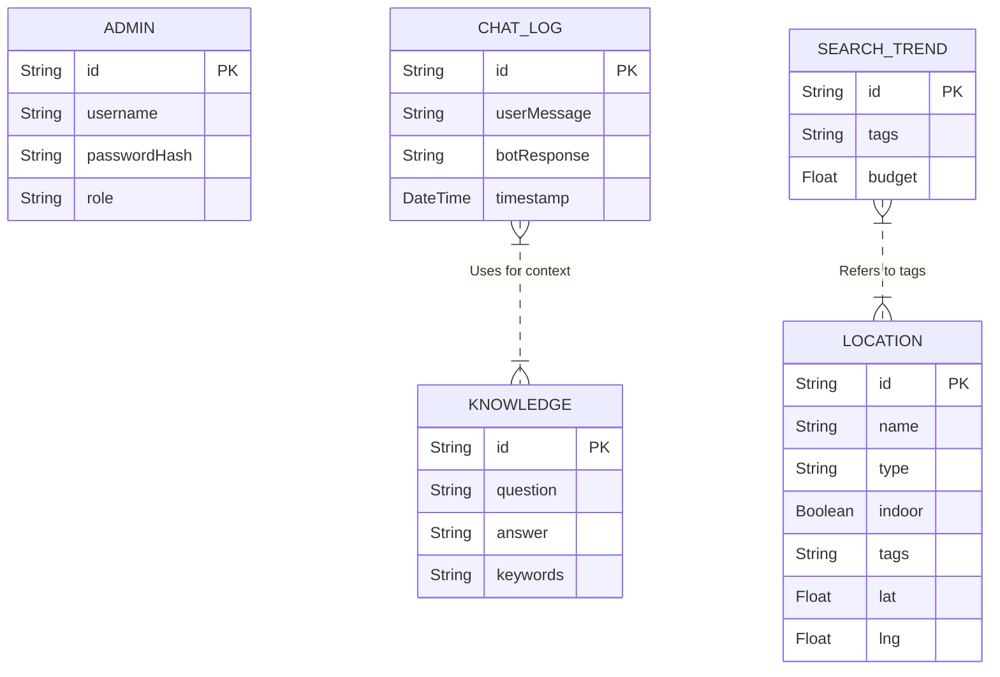
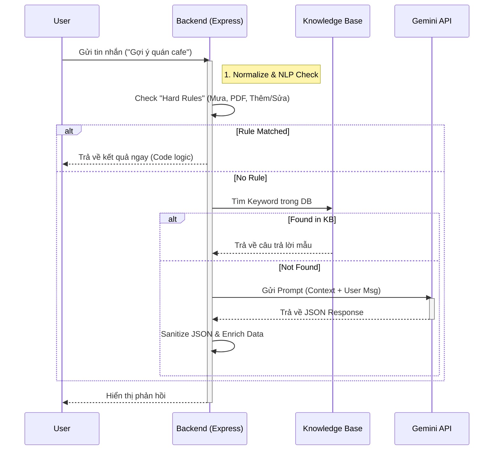

# KIẾN TRÚC HỆ THỐNG (SYSTEM ARCHITECTURE)

Tài liệu mô tả chi tiết kiến trúc kỹ thuật, cơ sở dữ liệu và các luồng thuật toán của hệ thống **DanangTravel-AI**.

## A. Thiết kế Cơ sở dữ liệu (Database Design)

Hệ thống sử dụng mô hình cơ sở dữ liệu quan hệ (Relational Database) được quản lý bởi **Prisma ORM**. Dưới đây là Sơ đồ Thực thể - Quan hệ (ERD) và mô tả chi tiết.

### 1. Entity Relationship Diagram (ERD)

### 2. Chi tiết các bảng (Data Dictionary)

#### Bảng `Location` (Địa điểm)
Lưu trữ dữ liệu cốt lõi về địa điểm du lịch, nhà hàng, khách sạn.
| Trường | Kiểu dữ liệu | Mô tả |
|:---|:---|:---|
| `id` | String (PK) | Mã định danh (VD: KV_01) |
| `name` | String | Tên địa điểm |
| `type` | String | Loại hình (attraction, restaurant, hotel...) |
| `indoor` | Boolean | Cờ đánh dấu địa điểm trong nhà (Hỗ trợ gợi ý khi mưa) |
| `tags` | JSON String | Các nhãn dán (culture, beach, nightlife...) |
| `priceLevel` | String | Mức giá (cheap, moderate, expensive) |
| `suggestedDuration`| Int | Thời gian tham quan đề xuất (phút) |

#### Bảng `Admin` (Quản trị viên)
| Trường | Kiểu dữ liệu | Mô tả |
|:---|:---|:---|
| `id` | String (PK) | Mã Admin |
| `username` | String | Tên đăng nhập |
| `passwordHash` | String | Mật khẩu (Lưu plain-text theo yêu cầu nghiệp vụ hiện tại) |
| `role` | String | Phân quyền (admin, editor) |

#### Bảng `Knowledge` (Cơ sở tri thức)
Hỗ trợ Chatbot trả lời các câu hỏi FAQ mà không cần gọi AI.
| Trường | Kiểu dữ liệu | Mô tả |
|:---|:---|:---|
| `keywords` | String | Từ khóa kích hoạt (VD: "mùa nào đẹp", "đặc sản") |
| `answer` | String | Câu trả lời mẫu đã được kiểm duyệt |

---

## B. Luồng hoạt động & Thuật toán (Algorithms & Flows)

### 1. Thuật toán Lập lịch trình Thông minh (Heuristic Scheduling)
Đây là "trái tim" của hệ thống, nằm tại `src/utils/generate-day-schedule-strict.js`. Thuật toán sử dụng chiến lược **Greedy (Tham lam)** kết hợp với **Constraint Satisfaction (Thỏa mãn ràng buộc)**.

#### Quy trình xử lý (Flowchart):
1.  **Khởi tạo**: Xác định Budget ngày, Thời gian bắt đầu (Start), Thời gian kết thúc (End).
2.  **Phân chia Phase**: Chia ngày thành 4 giai đoạn logic:
    *   *Sáng (Morning)*: 08:00 - 11:30
    *   *Trưa (Noon)*: 11:30 - 13:30 (Ăn trưa + Siesta/Nghỉ ngơi)
    *   *Chiều (Afternoon)*: 13:30 - 18:00
    *   *Tối (Evening)*: 18:00 - 22:30
3.  **Lặp và Lấp đầy (Iterative Filling)**:
    Tại mỗi thời điểm `CurrentTime`, hệ thống thực hiện:
    *   **Filter**: Lọc các địa điểm "khả thi" (Đủ budget, Loại hình phù hợp với Phase, Chưa đi).
    *   **Scoring (Tính điểm)**:
        $$ Score = (MatchPreference \times 30) + (ProximityScore \times 15) + (BudgetFit \times 10) + (Variety \times 5) $$
    *   **Select**: Chọn địa điểm có $Score$ cao nhất.
    *   **Update**: Trừ Budget, Cộng thời gian (Di chuyển + Tham quan), Cập nhật vị trí hiện tại.

### 2. Luồng xử lý Chatbot (Hybrid AI Flow)
Sử dụng mô hình lai để tối ưu tốc độ và chi phí.

---

## C. Các Use Cases chính (System Use Cases)

| Use Case | Actor | Mô tả chi tiết |
|:---|:---|:---|
| **UC01: Tạo Lịch trình** | Khách (Guest) | Người dùng nhập số người, ngân sách, ngày đi -> Hệ thống tính toán và trả về kế hoạch chi tiết từng giờ. Không cần đăng nhập. |
| **UC02: Chat tư vấn** | Khách (Guest) | Người dùng hỏi thông tin tự do. Bot trả lời dựa trên Knowledge Base hoặc AI. |
| **UC03: Điều chỉnh Lịch trình** | Khách (Guest) | Người dùng yêu cầu "Đổi quán cafe khác" -> Bot tìm địa điểm thay thế cùng loại, gần đó và cập nhật lại lịch trình. |
| **UC04: Quản lý Địa điểm** | Admin | Thêm/Sửa/Xóa địa điểm du lịch, cập nhật giá vé và menu. |
| **UC05: Theo dõi Xu hướng** | Admin | Xem các từ khóa (Tags) được người dùng lựa chọn nhiều nhất để tối ưu chiến lược dữ liệu. |

---

## D. Kết luận & Đánh giá
Hệ thống giải quyết bài toán lập lịch trình du lịch - một bài toán NP-hard - bằng cách tiếp cận Heuristic thực tế, đảm bảo trải nghiệm người dùng mượt mà (phản hồi < 2s) và tính khả thi cao của lịch trình tạo ra.
