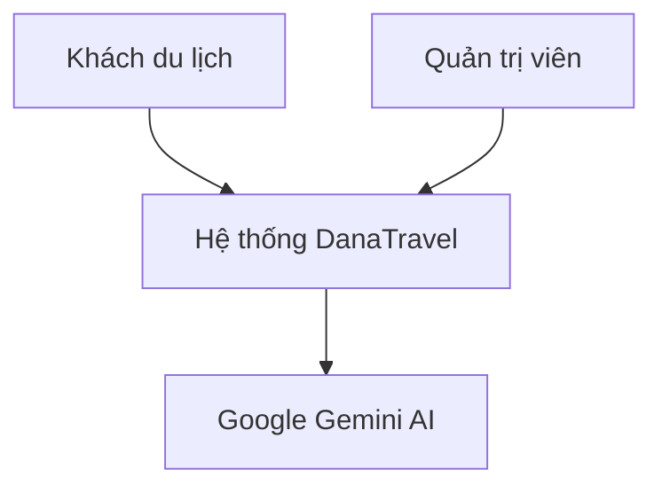
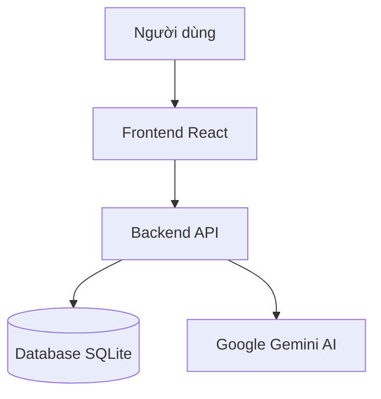
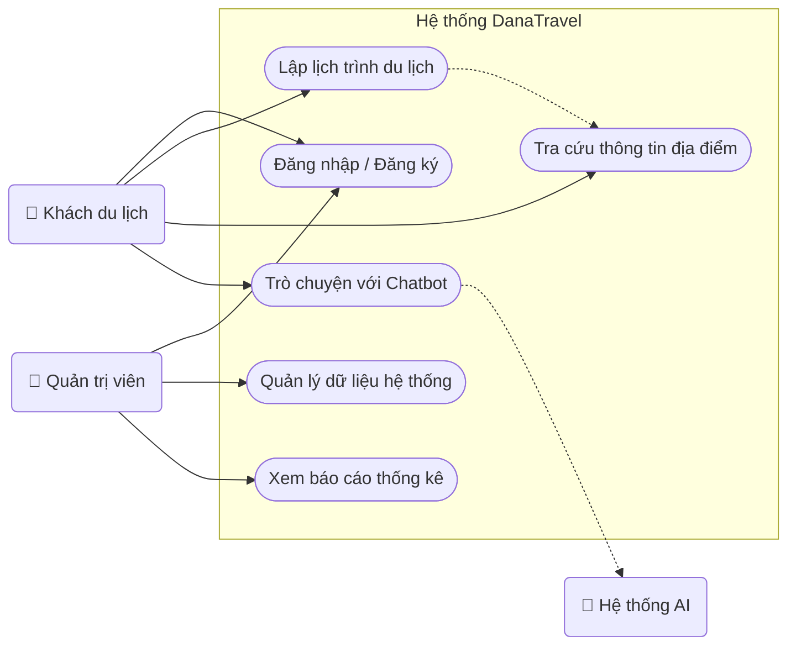
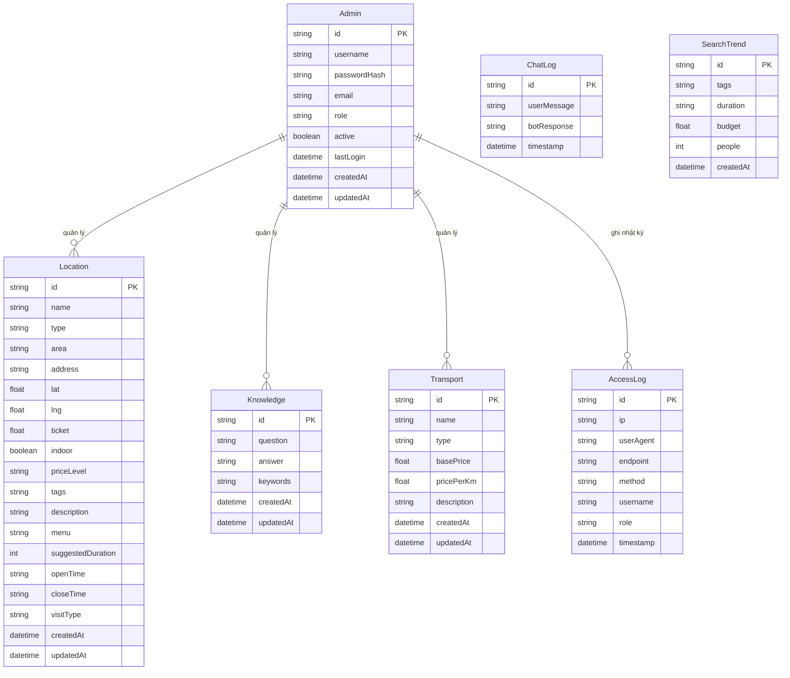
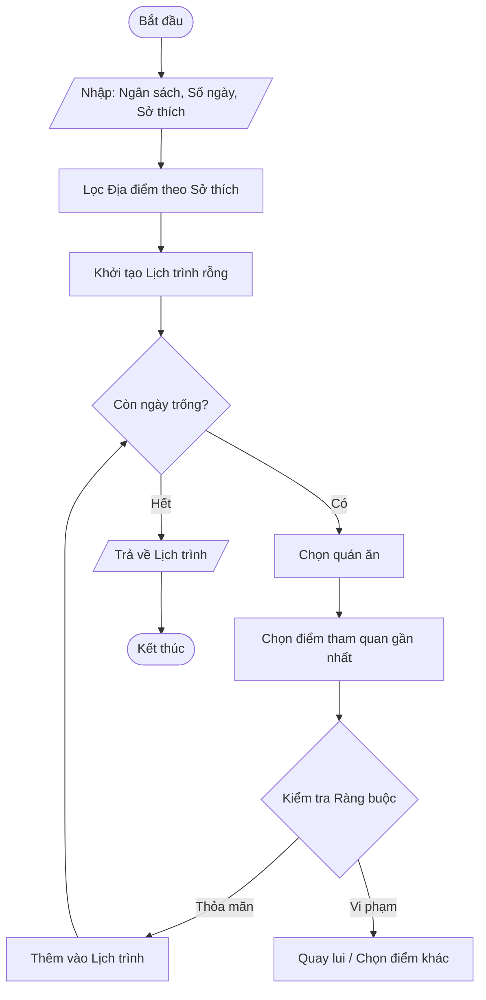
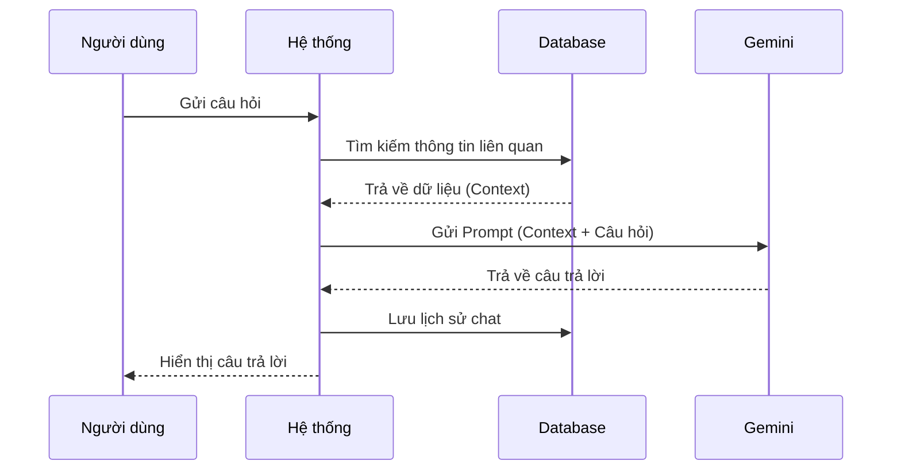

# Tài liệu Kiến trúc Hệ thống DanaTravel

Tài liệu này cung cấp cái nhìn tổng quan về kỹ thuật, kiến trúc, thiết kế dữ liệu và các luồng hoạt động chính của hệ thống DanaTravel.

## 1. Tổng quan Hệ thống

DanaTravel là một nền tảng **Trợ lý Du lịch Thông minh** sử dụng AI và các thuật toán ràng buộc chặt chẽ để lập kế hoạch du lịch cá nhân hóa.

### 1.1. Bối cảnh Hệ thống (C4 Level 1)



### 1.2. Kiến trúc Container (C4 Level 2)

Hệ thống được xây dựng theo kiến trúc Monolithic với Frontend và Backend tách biệt, giao tiếp qua RESTful APIs.



## 2. Công nghệ Sử dụng (Tech Stack)

| Thành phần | Công nghệ | Phiên bản | Mô tả |
| :--- | :--- | :--- | :--- |
| **Frontend** | React | ^18.2.0 | Thư viện UI chính |
| | Vite | ^5.0.8 | Build tool siêu tốc |
| | TailwindCSS | ^3.4.18 | Framework CSS utility-first |
| | React Router | ^6.20.0 | Quản lý điều hướng |
| **Backend** | Node.js | LTS | Môi trường chạy JavaScript |
| | Express | ^4.18.2 | Web framework |
| | Prisma | ^5.22.0 | ORM làm việc với Database |
| | SQLite | - | Cơ sở dữ liệu nhẹ |
| **AI** | Google Gemini | 1.5 Flash | Mô hình ngôn ngữ lớn (LLM) |

## 3. Sơ đồ Use Case

Sơ đồ Use Case mô tả các tương tác giữa các tác nhân (Actors) và hệ thống.

### 3.1. Các Tác nhân (Actors)

1.  **Khách du lịch (User)**: Người dùng cuối truy cập hệ thống để tìm kiếm thông tin và lập kế hoạch du lịch.
2.  **Quản trị viên (Admin)**: Người quản lý nội dung, dữ liệu địa điểm và theo dõi hoạt động của hệ thống.
3.  **Hệ thống AI (Gemini)**: Tác nhân phụ hỗ trợ trả lời câu hỏi và gợi ý lịch trình thông minh.

### 3.2. Danh sách Use Case

**Nhóm Khách du lịch:**
*   **Lập lịch trình tự động**: Nhập ngân sách, số ngày, sở thích để tạo lịch trình.
*   **Tùy chỉnh lịch trình**: Thay đổi các tham số để tạo lại lịch trình.
*   **Trò chuyện với AI**: Hỏi đáp thông tin du lịch Đà Nẵng.
*   **Tra cứu địa điểm**: Xem thông tin chi tiết, giá vé, menu của các địa điểm.

**Nhóm Quản trị viên:**
*   **Đăng nhập hệ thống**: Truy cập vào trang quản trị.
*   **Quản lý địa điểm**: Thêm, sửa, xóa thông tin địa điểm du lịch/ăn uống.
*   **Quản lý tri thức AI**: Cập nhật cơ sở dữ liệu câu hỏi/câu trả lời cho Chatbot.
*   **Xem báo cáo thống kê**: Xem lưu lượng truy cập, xu hướng tìm kiếm.
*   **Quản lý tài khoản**: Thêm hoặc xóa các quản trị viên khác.

### 3.3. Sơ đồ Minh họa

### 3.3. Sơ đồ Use Case (UML)

> [!NOTE]
> Trình xem của bạn chưa hỗ trợ hiển thị `usecaseDiagram`. Dưới đây là 2 phiên bản:
> 1. **Mã nguồn chuẩn UML**: Dùng để copy vào báo cáo hoặc các tool vẽ UML chuyên dụng.
> 2. **Sơ đồ hiển thị**: Dùng để xem trực tiếp tại đây (dạng tương thích).

#### Mã nguồn chuẩn UML (Copy cho báo cáo)
```text
usecaseDiagram
    actor "Khách du lịch" as User
    actor "Quản trị viên" as Admin
    actor "Hệ thống AI" as AI

    package "Hệ thống DanaTravel" {
        usecase "Đăng nhập / Đăng ký" as UC1
        usecase "Lập lịch trình du lịch" as UC2
        usecase "Tra cứu thông tin địa điểm" as UC3
        usecase "Trò chuyện với Chatbot" as UC4
        usecase "Quản lý dữ liệu hệ thống" as UC5
        usecase "Xem báo cáo thống kê" as UC6
    }

    User --> UC1
    User --> UC2
    User --> UC3
    User --> UC4

    Admin --> UC1
    Admin --> UC5
    Admin --> UC6

    UC4 ..> AI : "Sử dụng API"
    UC2 ..> UC3 : "Include"
```

#### Sơ đồ hiển thị (Chế độ tương thích)


### 3.4. Đặc tả Use Case (Use Case Specification)

| ID | Tên Use Case | Tác nhân chính | Mô tả tóm tắt |
| :--- | :--- | :--- | :--- |
| **UC1** | Đăng nhập | User, Admin | Xác thực người dùng vào hệ thống. |
| **UC2** | Lập lịch trình | User | Tạo lịch trình dựa trên ngân sách, thời gian, sở thích. |
| **UC3** | Tra cứu địa điểm | User | Xem thông tin chi tiết, giá vé, menu của địa điểm. |
| **UC4** | Chat với Bot | User | Hỏi đáp thông tin du lịch qua giao diện chat. |
| **UC5** | Quản lý dữ liệu | Admin | Thêm/Sửa/Xóa địa điểm, bài viết tri thức. |
| **UC6** | Xem báo cáo | Admin | Theo dõi thống kê truy cập và xu hướng. |

## 4. Thiết kế Cơ sở dữ liệu (ERD)

Sơ đồ mô tả cấu trúc dữ liệu và mối quan hệ giữa các thực thể trong hệ thống.

### 4.1. Các Thực thể (Entities)

1.  **Location (Địa điểm)**: Lưu trữ thông tin các điểm tham quan, nhà hàng, khách sạn.
2.  **Admin (Quản trị viên)**: Tài khoản quản trị hệ thống.
3.  **Knowledge (Tri thức)**: Dữ liệu hỏi đáp mẫu dùng cho RAG (Retrieval-Augmented Generation).
4.  **ChatLog (Lịch sử Chat)**: Lưu lại các cuộc hội thoại giữa người dùng và Bot.
5.  **AccessLog (Nhật ký truy cập)**: Ghi lại hoạt động truy cập API để thống kê.
6.  **SearchTrend (Xu hướng tìm kiếm)**: Lưu lại các từ khóa và nhu cầu tìm kiếm của người dùng.
7.  **Transport (Phương tiện)**: Bảng giá và loại hình phương tiện di chuyển.

### 4.2. Sơ đồ Minh họa


*Hình 4.2: Sơ đồ ERD thiết kế cơ sở dữ liệu*

### 4.3. Mô tả Quan hệ (Relationship Description)

Mặc dù hệ thống sử dụng SQLite và Prisma không thiết lập khóa ngoại cứng (Foreign Key Constraints) để tối ưu hiệu năng đọc ghi, nhưng về mặt logic nghiệp vụ (Business Logic), các thực thể có mối quan hệ chặt chẽ như sau:

1.  **Admin - Location (1-n)**: Một Quản trị viên có thể tạo và quản lý nhiều Địa điểm.
2.  **Admin - Knowledge (1-n)**: Một Quản trị viên có thể cập nhật nhiều mục Tri thức cho AI.
3.  **Admin - AccessLog (1-n)**: Mọi hành động của Admin đều được ghi lại trong nhiều dòng Nhật ký truy cập.
4.  **Location - SearchTrend (n-n)**: (Gián tiếp) Các thẻ (Tags) của địa điểm được liên kết với xu hướng tìm kiếm của người dùng thông qua phân tích từ khóa.

## 5. Luồng Hoạt động (Activity Flows)

### 5.1. Quy trình Lập Lịch trình (Algorithm)

Đây là quy trình phức tạp nhất, sử dụng thuật toán CSP (Constraint Satisfaction Problem) để đảm bảo lịch trình khả thi.

**Mô tả luồng:**
1.  Người dùng nhập: Ngân sách, Số ngày, Sở thích (Tags).
2.  Hệ thống lọc danh sách `Location` phù hợp với Sở thích.
3.  Hệ thống khởi tạo lịch trình rỗng cho từng ngày.
4.  **Vòng lặp xếp lịch (Greedy + Backtracking)**:
    *   Chọn địa điểm ăn trưa/tối phù hợp ngân sách.
    *   Chọn địa điểm tham quan dựa trên khoảng cách địa lý (gần địa điểm trước đó) và giờ mở cửa.
    *   Kiểm tra ràng buộc: Tổng chi phí < Ngân sách, Tổng thời gian < Thời gian trong ngày.
5.  Nếu không tìm được phương án khả thi -> Thông báo hoặc gợi ý nới lỏng ngân sách.
6.  Nếu thành công -> Trả về JSON lịch trình chi tiết.



### 5.2. Quy trình Chatbot (RAG)

Quy trình xử lý khi người dùng đặt câu hỏi cho Chatbot.

**Mô tả luồng:**
1.  Người dùng gửi tin nhắn.
2.  Hệ thống tìm kiếm từ khóa trong bảng `Knowledge` và `Location`.
3.  Lấy các thông tin liên quan nhất (Context).
4.  Gửi Prompt = "Context + Câu hỏi người dùng" đến Google Gemini AI.
5.  Gemini trả về câu trả lời tự nhiên.
6.  Hệ thống lưu hội thoại vào `ChatLog` và hiển thị cho người dùng.



## 6. Cấu trúc Thư mục Dự án

```
Dana-Travel/
├── Frontend/           # Ứng dụng React
│   ├── src/
│   │   ├── components/ # Các thành phần UI tái sử dụng
│   │   ├── features/   # Các module tính năng (itinerary, admin...)
│   │   ├── pages/      # Các trang điều hướng (Route pages)
│   │   └── services/   # Các service gọi API
│
├── Backend/            # Ứng dụng Express
│   ├── prisma/         # Schema cơ sở dữ liệu & seeds
│   ├── src/
│   │   ├── adapters/   # Kết nối dịch vụ ngoài (Gemini)
│   │   ├── config/     # Cấu hình & Hằng số (Rules, prompts)
│   │   ├── controllers/# Bộ xử lý yêu cầu (Request handlers)
│   │   ├── middleware/ # Middleware (Auth, Logger, Error)
│   │   ├── services/   # Logic nghiệp vụ (The "Brain")
│   │   ├── routes/     # Các điểm cuối API (Endpoints)
│   │   └── utils/      # Tiện ích hỗ trợ (Tính khoảng cách, định dạng)
│
└── docs/               # Tài liệu dự án
```

## 7. Hướng dẫn Cài đặt & Triển khai

### Yêu cầu hệ thống
- Node.js (v18 trở lên)
- Git

### Bước 1: Clone dự án
```bash
git clone <repository-url>
cd Dana-Travel
```

### Bước 2: Cài đặt Backend
```bash
cd Backend
npm install
# Tạo file .env (tham khảo .env.example)
# Chạy migration và seed dữ liệu
npx prisma migrate dev --name init
npx prisma db seed
# Khởi chạy server
npm run dev
```

**Cấu hình .env (Backend):**
```env
PORT=3000
DATABASE_URL="file:./dev.db"
GEMINI_API_KEY="<YOUR_API_KEY>"
GEMINI_MODEL="gemini-1.5-flash"
```

### Bước 3: Cài đặt Frontend
```bash
cd ../Frontend
npm install
# Khởi chạy dev server
npm run dev
```
Truy cập: `http://localhost:5173`

## 8. Tóm tắt API

### Authentication
- `POST /api/admin/login`: Đăng nhập Admin
- `POST /api/admin/logout`: Đăng xuất

### Itinerary
- `POST /api/itinerary/generate`: Tạo lịch trình mới
- `GET /api/locations`: Lấy danh sách địa điểm

### Chatbot
- `POST /api/chat/message`: Gửi tin nhắn và nhận phản hồi từ AI

### Locations
- `GET /api/locations/:id`: Chi tiết địa điểm
- `POST /api/locations`: Thêm địa điểm (Admin)
- `PUT /api/locations/:id`: Cập nhật địa điểm (Admin)
- `DELETE /api/locations/:id`: Xóa địa điểm (Admin)
