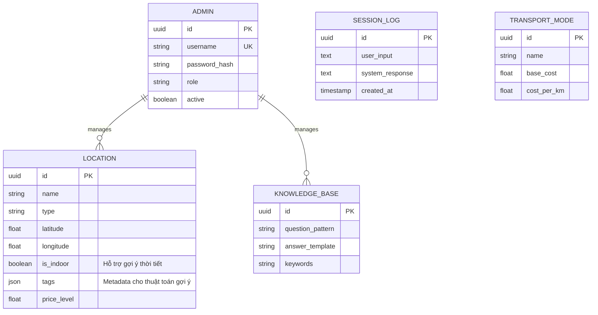

# TÀI LIỆU KIẾN TRÚC HỆ THỐNG (SYSTEM ARCHITECTURE DOCUMENT)

**Dự án:** DanangTravel-AI - Hệ thống Lập lịch trình Du lịch Thông minh  
**Phiên bản:** 1.0  

---

## 1. Tổng quan Kiến trúc (Architectural Overview)

Hệ thống được thiết kế dựa trên mô hình **Client-Server** theo kiến trúc **Three-Tier Monolithic** (Ba tầng nguyên khối), tích hợp các dịch vụ bên thứ ba (Third-party Services) để xử lý tác vụ trí tuệ nhân tạo.

Kiến trúc này được lựa chọn để đảm bảo sự cân bằng giữa hiệu năng (Performance), khả năng bảo trì (Maintainability) và tốc độ phát triển (Development Velocity).

### 1.1. Mô hình C4 - Level 1: System Context
Sơ đồ ngữ cảnh hệ thống mô tả ranh giới và sự tương tác giữa hệ thống với các tác nhân bên ngoài.

```mermaid
graph TD
    User((Khách Du Lịch))
    Admin((Quản Trị Viên))
    
    subgraph "Internal System"
        System[Hệ thống DanaTravel-AI]
    end
    
    ExternalAI[Google Gemini AI Service]
    ExternalMaps[Google Maps Platform]
    
    User -->|Truy vấn thông tin & Lập lịch| System
    Admin -->|Quản lý dữ liệu & Cấu hình| System
    
    System -->|API Request (GenAI)| ExternalAI
    System -->|Geocoding & Labeling| ExternalMaps
```

### 1.2. Mô hình C4 - Level 2: Container Architecture
Sơ đồ Container mô tả các đơn vị phần mềm (Software Units) và công nghệ được sử dụng.

```mermaid
graph TD
    User((User Interface))
    
    subgraph "Client Layer (Presentation)"
        SPA[Single Page Application\n(ReactJS + Vite)]
    end
    
    subgraph "Server Layer (Business Logic)"
        API[RESTful API Server\n(Node.js + Express)]
    end
    
    subgraph "Persistence Layer (Data)"
        DB[(Relational Database\nSQLite/PostgreSQL)]
    end
    
    ExternalAI[Generative AI Service\n(Google Gemini)]

    User -->|HTTPS/Interaction| SPA
    SPA -->|JSON/REST| API
    
    API -->|ORM Query (Prisma)| DB
    DB -->|Result Set| API
    
    API -->|Inference Request| ExternalAI
    ExternalAI -->|Completion Response| API
    
    style SPA fill:#E1F5FE,stroke:#01579B
    style API fill:#FFF3E0,stroke:#E65100
    style DB fill:#E8F5E9,stroke:#1B5E20
    style ExternalAI fill:#F3E5F5,stroke:#4A148C
```

**Mô tả thành phần:**
1.  **Presentation Layer (SPA):** Ứng dụng ReactJS chịu trách nhiệm hiển thị giao diện, quản lý trạng thái (State Management) và điều hướng người dùng. Không chứa logic nghiệp vụ phức tạp.
2.  **Business Logic Layer (API Server):** Xử lý các yêu cầu nghiệp vụ trung tâm như: Lập lịch trình, Xác thực (Authentication), Tích hợp AI. Sử dụng kiến trúc MVC (Model-View-Controller).
3.  **Persistence Layer (Database):** Lưu trữ dữ liệu có cấu trúc. Sử dụng Prisma ORM để trừu tượng hóa các câu lệnh SQL, tăng tính bảo mật và nhất quán dữ liệu.

---

## 2. Thiết kế Dữ liệu (Data Design)

Mô hình dữ liệu được thiết kế theo chuẩn **Relational Database Model**. Dưới đây là Sơ đồ Thực thể - Quan hệ (ERD - Entity Relationship Diagram).



**Chuẩn hóa dữ liệu:**
*   Các bảng được thiết kế đạt chuẩn 3NF (Third Normal Form) để giảm thiểu dư thừa dữ liệu.
*   Bảng `Location` sử dụng cột JSON `tags` để hỗ trợ tính linh hoạt (schema-less) cho các thuộc tính tìm kiếm phong phú.

---

## 3. Đặc tả Thuật toán (Algorithmic Specification)

### 3.1. Thuật toán Lập lịch trình Heuristic (Heuristic Scheduling Algorithm)

Hệ thống giải quyết bài toán Lập lịch trình du lịch (một biến thể của bài toán **Traveling Salesperson Problem (TSP)** kết hợp **Knapsack Problem**) bằng phương pháp tham lam (Greedy approach) với các hàm heuristic.

**Quy trình xử lý:**

1.  **Khởi tạo (Initialization):**
    *   Đầu vào: $T_{start}, T_{end}, Budget, Preferences[]$.
    *   Tập dữ liệu ứng viên: $L = \{l_1, l_2, ..., l_n\}$ (Tất cả địa điểm khả thi).

2.  **Phân rã (Decomposition):**
    *   Chia thời gian thành các **Time Slots**: $S = [S_{morning}, S_{noon}, S_{afternoon}, S_{evening}]$.

3.  **Lặp và Tối ưu cục bộ (Iteration & Local Optimization):**
    *   Với mỗi Slot $S_i$ tại thời điểm hiện tại $t_{curr}$:
        1.  **Lọc (Filter):** Loại bỏ các điểm $l_k$ nếu:
            *   $l_k$ đã thăm.
            *   $l_k$ đóng cửa tại $t_{curr}$.
            *   $Cost(l_k) > Budget_{remaining}$.
        2.  **Tính điểm trọng số (Scoring Function):**
            $$ Score(l_k) = w_1 \cdot P(l_k) + w_2 \cdot \frac{1}{D(pos, l_k)} + w_3 \cdot V(l_k) $$
            *   Trong đó:
                *   $P(l_k)$: Điểm phù hợp sở thích (Preference Match).
                *   $D(pos, l_k)$: Khoảng cách từ vị trí hiện tại.
                *   $V(l_k)$: Chỉ số đa dạng loại hình (Variety Index).
        3.  **Lựa chọn (Selection):** Chọn $l_{best} = \arg\max(Score(l))$.

4.  **Kết thúc:** Khi hết thời gian hoặc ngân sách.

### 3.2. Quy trình Xử lý Ngôn ngữ Tự nhiên Lai (Hybrid NLP Pipeline)

Để đảm bảo độ chính xác nghiệp vụ (Domain Accuracy), hệ thống không phụ thuộc hoàn toàn vào LLM mà sử dụng cơ chế lai:

1.  **Pattern Matching Layer:**
    *   Sử dụng Regular Expressions để bắt các Intent cứng (Ví dụ: "thời tiết", "xuất pdf").
    *   Độ trễ: < 10ms. Độ chính xác: 100%.

2.  **Semantic Search Layer:**
    *   Truy vấn `Knowledge Base` để tìm các câu hỏi FAQ tương tự.

3.  **Generative AI Layer (Fallback):**
    *   Chỉ khi không khớp 2 lớp trên, Input được chuyển tới **Google Gemini**.
    *   **Prompt Engineering technique:** Dùng kỹ thuật *Few-Shot Prompting* để định hướng AI trả về định dạng JSON cấu trúc thay vì văn bản tự do.
    *   **Post-processing:** Module `JSON Sanitizer` đảm bảo tính toàn vẹn của dữ liệu trả về trước khi render.

---

## 4. Phân tích Ca sử dụng (Use Case Analysis)

| ID | Tên Use Case | Actor | Loại | Mô tả Tóm tắt |
|:---|:---|:---|:---|:---|
| UC-01 | **Generate Itinerary** | User | Chính | Hệ thống tự động tạo lịch trình dựa trên ràng buộc đầu vào (Budget, Time, Constraints). |
| UC-02 | **Contextual Query** | User | Hỗ trợ | Người dùng hỏi thông tin ngữ cảnh (Ví dụ: "Trời mưa đi đâu?"). Hệ thống kích hoạt logic lọc `is_indoor=true`. |
| UC-03 | **Modify Schedule** | User | Chính | Người dùng yêu cầu thay đổi một điểm đến. Hệ thống tìm điểm thay thế (Alternative) có cùng `Type` và vị trí lân cận. |
| UC-04 | **Resource Management** | Admin | Quản trị | CRUD (Create, Read, Update, Delete) dữ liệu Địa điểm và Dữ liệu huấn luyện (Knowledge Base). |

---

## 5. Kết luận (Conclusion)
Kiến trúc này đảm bảo tính **Scalability** (có thể mở rộng sang Microservices sau này) và **Reliability** (hoạt động đúng ngay cả khi dịch vụ AI bị gián đoạn nhờ lớp Fallback logic). Việc sử dụng thuật toán Heuristic cho phép hệ thống phản hồi thời gian thực (Real-time response) mà vẫn đảm bảo chất lượng lịch trình tối ưu.
