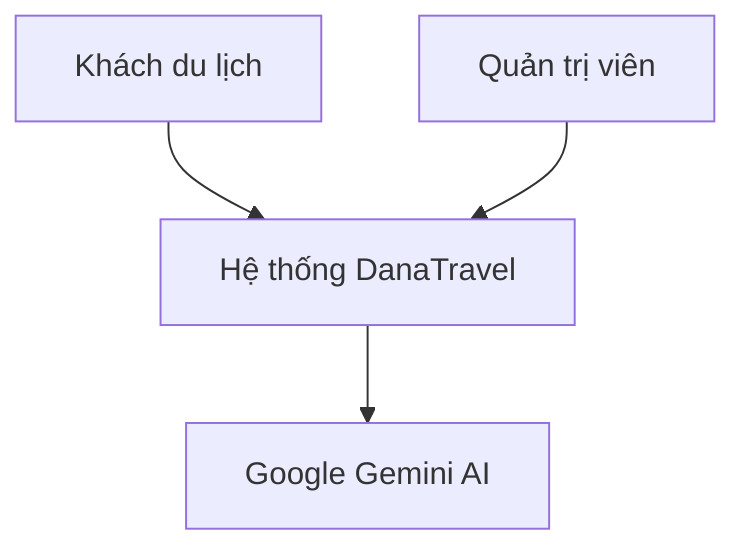
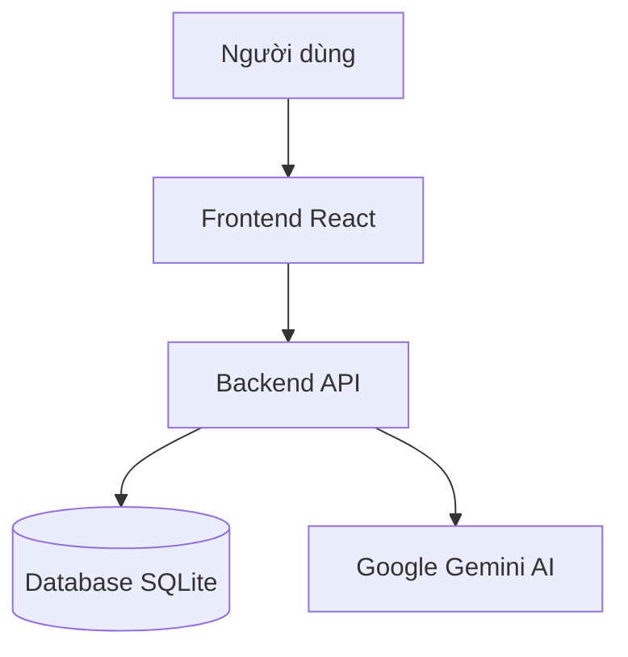
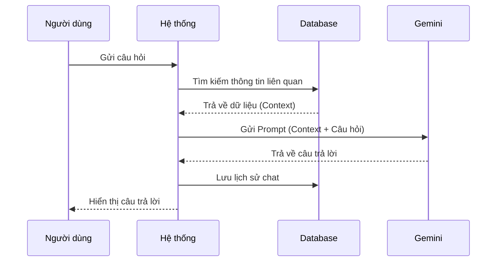

# Tài liệu Kiến trúc Hệ thống DanaTravel

Tài liệu này cung cấp cái nhìn tổng quan về kỹ thuật, kiến trúc, thiết kế dữ liệu và các luồng hoạt động chính của hệ thống DanaTravel.

## 1. Tổng quan Hệ thống

DanaTravel là một nền tảng **Trợ lý Du lịch Thông minh** sử dụng AI và các thuật toán ràng buộc chặt chẽ để lập kế hoạch du lịch cá nhân hóa.

### 1.1. Bối cảnh Hệ thống (C4 Level 1)



### 1.2. Kiến trúc Container (C4 Level 2)

Hệ thống được xây dựng theo kiến trúc Monolithic với Frontend và Backend tách biệt, giao tiếp qua RESTful APIs.



## 2. Công nghệ Sử dụng (Tech Stack)

| Thành phần | Công nghệ | Phiên bản | Mô tả |
| :--- | :--- | :--- | :--- |
| **Frontend** | React | ^18.2.0 | Thư viện UI chính |
| | Vite | ^5.0.8 | Build tool siêu tốc |
| | TailwindCSS | ^3.4.18 | Framework CSS utility-first |
| | React Router | ^6.20.0 | Quản lý điều hướng |
| **Backend** | Node.js | LTS | Môi trường chạy JavaScript |
| | Express | ^4.18.2 | Web framework |
| | Prisma | ^5.22.0 | ORM làm việc với Database |
| | SQLite | - | Cơ sở dữ liệu nhẹ |
| **AI** | Google Gemini | 1.5 Flash | Mô hình ngôn ngữ lớn (LLM) |

## 3. Thiết kế Cơ sở dữ liệu (ERD)

Dưới đây là sơ đồ thực thể - quan hệ (ERD) đầy đủ của hệ thống, phản ánh chính xác cấu trúc trong `schema.prisma`.


## 4. Luồng Hoạt động (Activity Flows)

### 4.1. Quy trình Lập Lịch trình (Algorithm)


### 4.2. Quy trình Chatbot (RAG)



## 5. Cấu trúc Thư mục Dự án

```
Dana-Travel/
├── Frontend/           # Ứng dụng React
│   ├── src/
│   │   ├── components/ # Các thành phần UI tái sử dụng
│   │   ├── features/   # Các module tính năng
│   │   ├── pages/      # Các trang điều hướng
│   │   └── services/   # Các service gọi API
│
├── Backend/            # Ứng dụng Express
│   ├── prisma/         # Schema cơ sở dữ liệu & seeds
│   ├── src/
│   │   ├── adapters/   # Kết nối dịch vụ ngoài (Gemini)
│   │   ├── config/     # Cấu hình & Hằng số
│   │   ├── controllers/# Bộ xử lý yêu cầu
│   │   ├── middleware/ # Middleware
│   │   ├── services/   # Logic nghiệp vụ
│   │   ├── routes/     # Các điểm cuối API
│   │   └── utils/      # Tiện ích hỗ trợ
│
└── docs/               # Tài liệu dự án
```

## 6. Tóm tắt API

### Authentication
- `POST /api/admin/login`: Đăng nhập Admin

### Itinerary
- `POST /api/itinerary/generate`: Tạo lịch trình
- `GET /api/locations`: Lấy danh sách địa điểm

### Chatbot
- `POST /api/chat/message`: Chat với AI

### Locations
- `GET /api/locations/:id`: Chi tiết địa điểm
- `POST /api/locations`: Thêm địa điểm (Admin)
- `PUT /api/locations/:id`: Sửa địa điểm (Admin)
- `DELETE /api/locations/:id`: Xóa địa điểm (Admin)
