# KIẾN TRÚC HỆ THỐNG - Dana Travel

> **Tài liệu Kỹ thuật Chi tiết**  
> **Phiên bản**: 3.0  
> **Cập nhật**: 2025-12-03

---

## Mục Lục

1. [Tổng Quan Hệ Thống](#1-tổng-quan-hệ-thống)
2. [Sơ Đồ Kiến Trúc](#2-sơ-đồ-kiến-trúc)
3. [Luồng Dữ Liệu](#3-luồng-dữ-liệu)
4. [Kiến Trúc Database](#4-kiến-trúc-database)
5. [Kiến Trúc Backend](#5-kiến-trúc-backend)
6. [Kiến Trúc Frontend](#6-kiến-trúc-frontend)
7. [Kiến Trúc Bảo Mật](#7-kiến-trúc-bảo-mật)
8. [Kiến Trúc Triển Khai](#8-kiến-trúc-triển-khai)

---

## 1. Tổng Quan Hệ Thống

### 1.1 Kiến Trúc Tổng Quan

Dana Travel là hệ thống lập kế hoạch du lịch Full-Stack với chatbot AI, được xây dựng theo mô hình Client-Server.

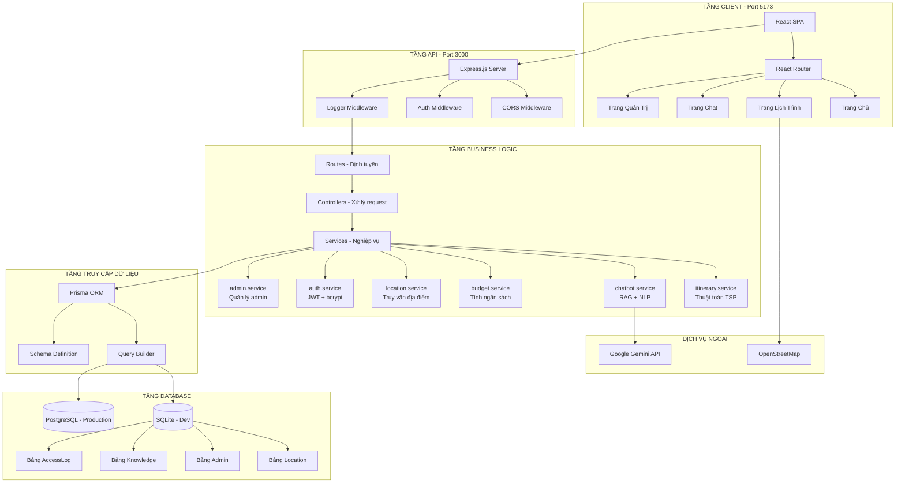

### 1.2 Các Nguyên Tắc Thiết Kế

1. **Phân Tách Trách Nhiệm**: Logic nghiệp vụ được tách riêng trong các services
2. **Trách Nhiệm Đơn Lẻ**: Mỗi module có một mục đích rõ ràng
3. **Nguyên Tắc DRY**: Các tiện ích dùng chung được trích xuất
4. **Thiết Kế API-First**: Backend cung cấp RESTful API
5. **Backend Không Trạng Thái**: Xác thực dựa trên JWT
6. **Nâng Cao Tiến Bộ**: Chức năng cốt lõi hoạt động mà không cần JavaScript

---

## 2. Sơ Đồ Kiến Trúc

### 2.1 Luồng Tương Tác Giữa Các Thành Phần

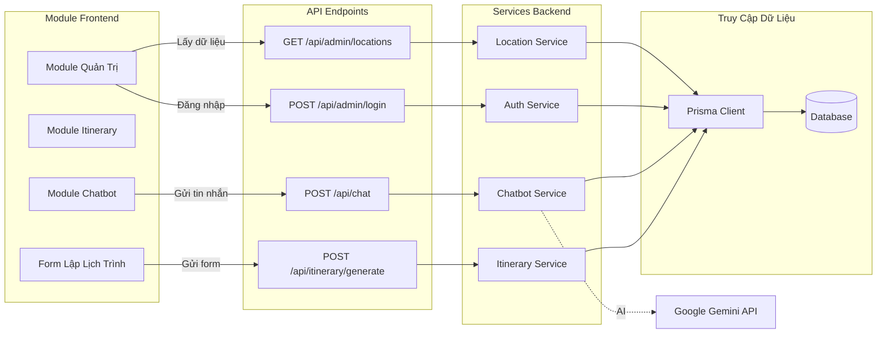

### 2.2 Sơ Đồ Phụ Thuộc Giữa Các Module

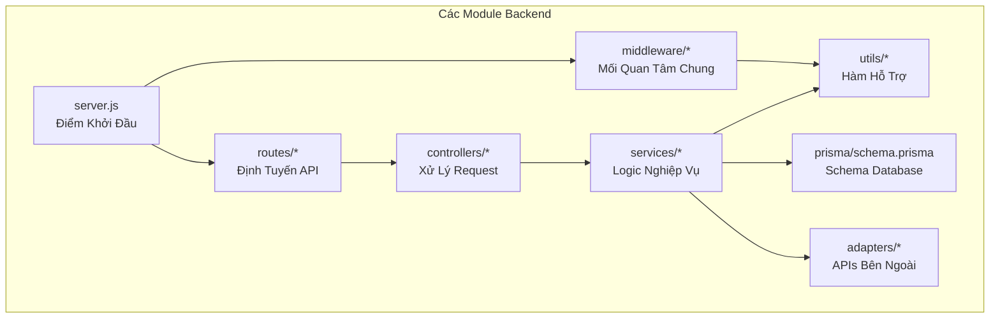

---

## 3. Luồng Dữ Liệu

### 3.1 Quy Trình Tạo Lịch Trình

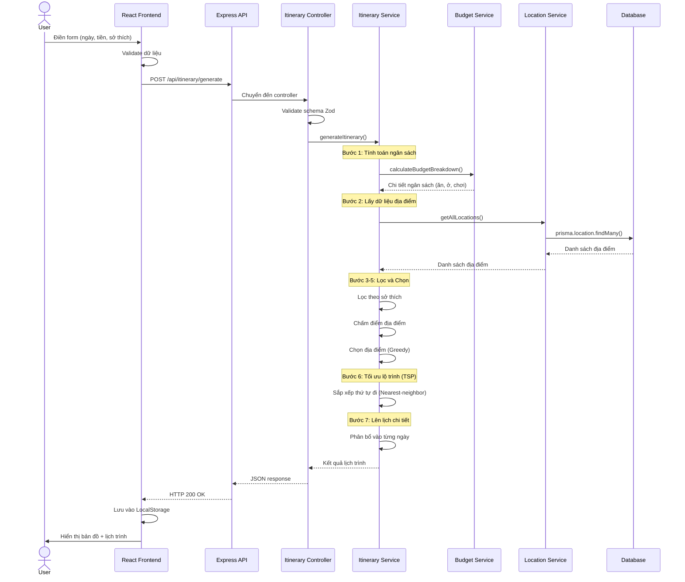

### 3.2 Quy Trình Chatbot (RAG)

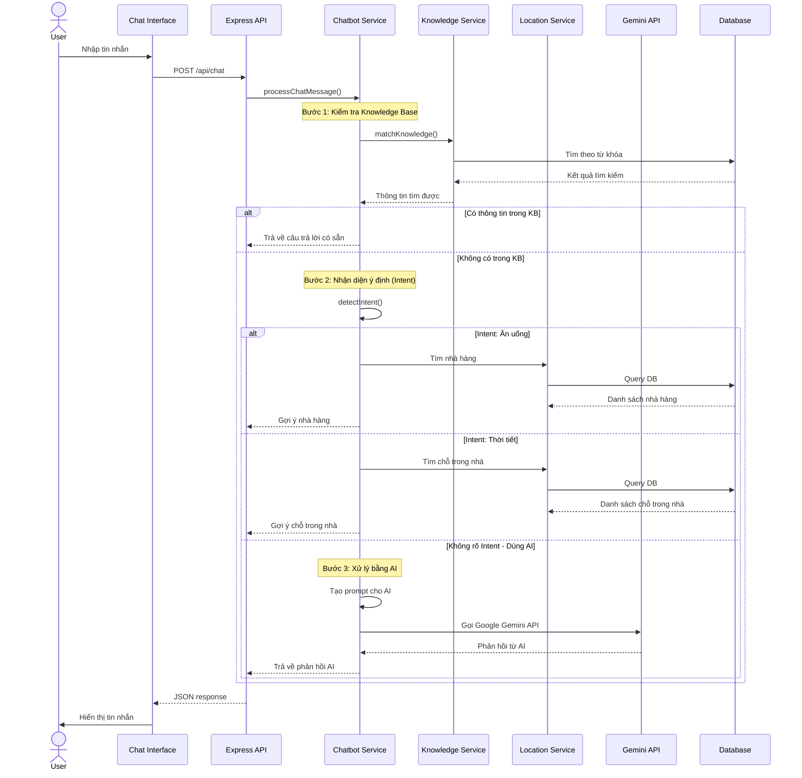

### 3.3 Quy Trình Đăng Nhập Admin

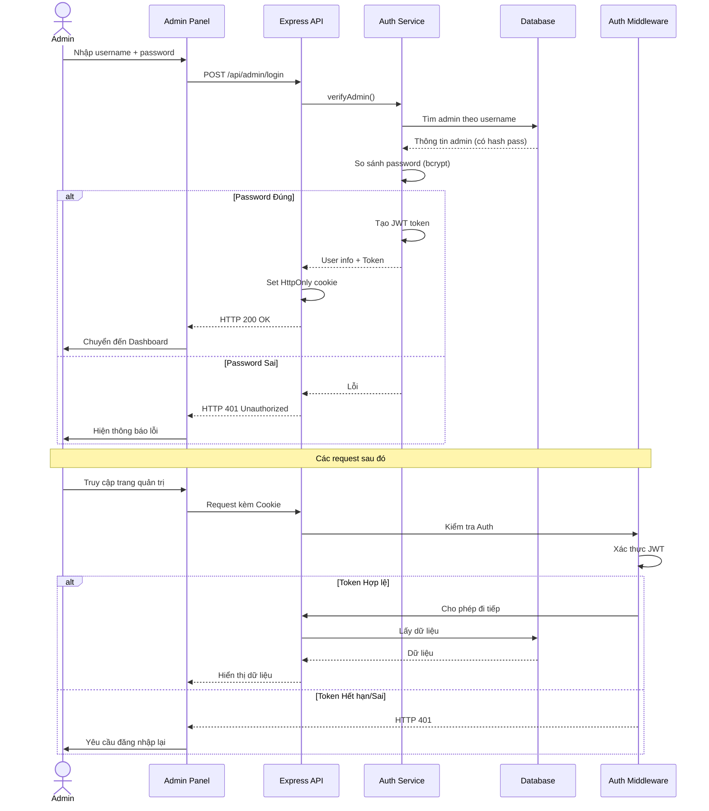

---

## 4. Kiến Trúc Database

### 4.1 Sơ Đồ Thực Thể (ERD)

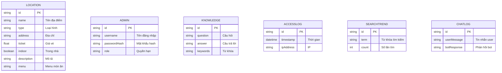

### 4.2 Mô Tả Các Bảng

**Location (Địa điểm)**: Lưu trữ thông tin các điểm du lịch, nhà hàng, khách sạn.
**Admin (Quản trị viên)**: Lưu trữ tài khoản quản trị hệ thống.
**Knowledge (Kiến thức)**: Cơ sở dữ liệu câu hỏi - câu trả lời cho chatbot.
**AccessLog (Nhật ký truy cập)**: Ghi lại lịch sử truy cập để thống kê.
**SearchTrend (Xu hướng tìm kiếm)**: Thống kê các từ khóa được tìm kiếm nhiều.
**ChatLog (Lịch sử chat)**: Lưu lại nội dung hội thoại để cải thiện AI.

---

## 5. Kiến Trúc Backend

### 5.1 Cấu Trúc Module

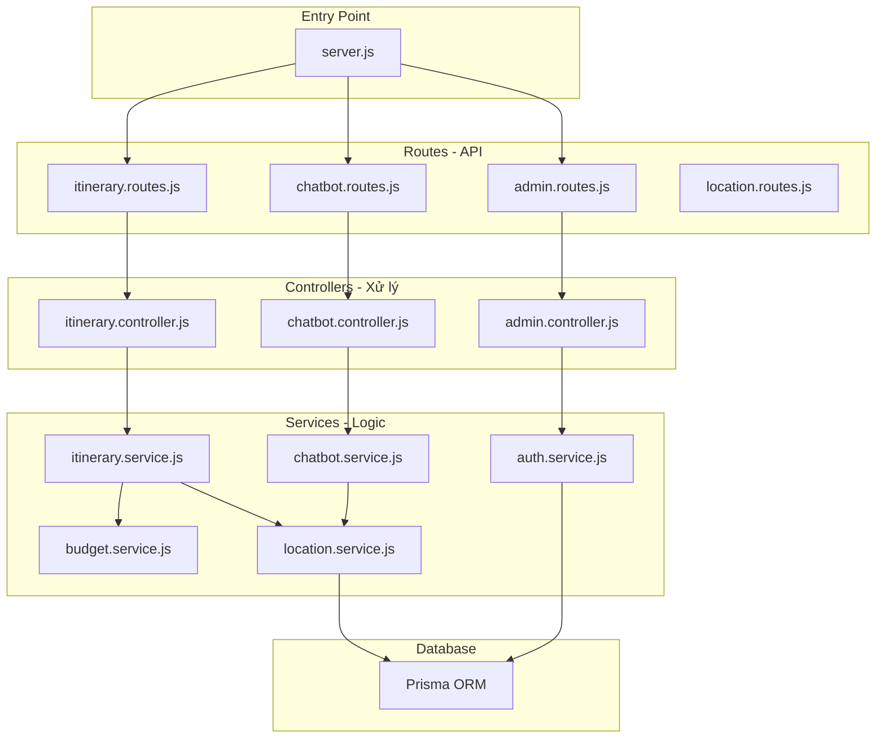

---

## 6. Kiến Trúc Frontend

### 6.1 Cây Component

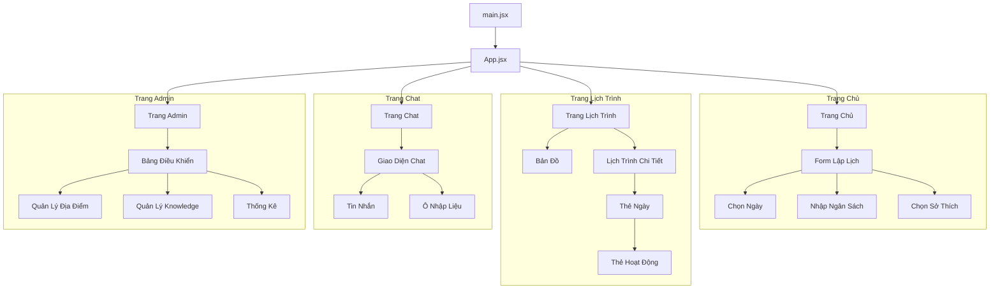

### 6.2 Luồng Quản Lý State

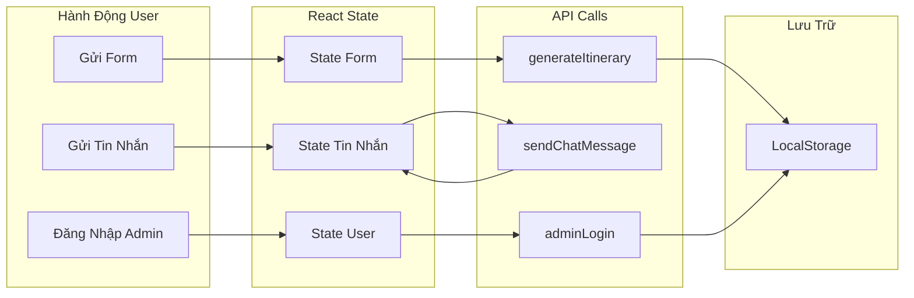

---

## 7. Kiến Trúc Bảo Mật

### 7.1 Các Lớp Bảo Mật

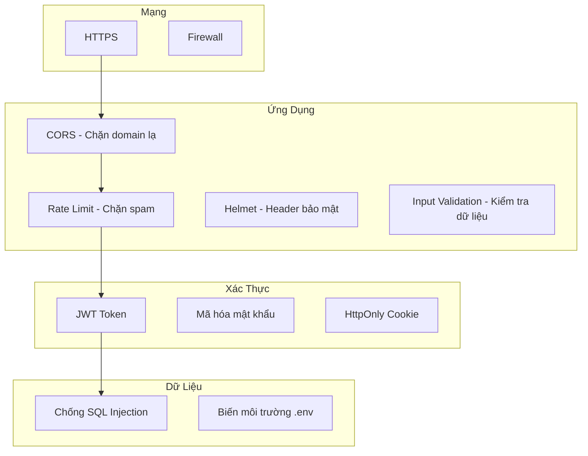

### 7.2 Quy Trình Xác Thực

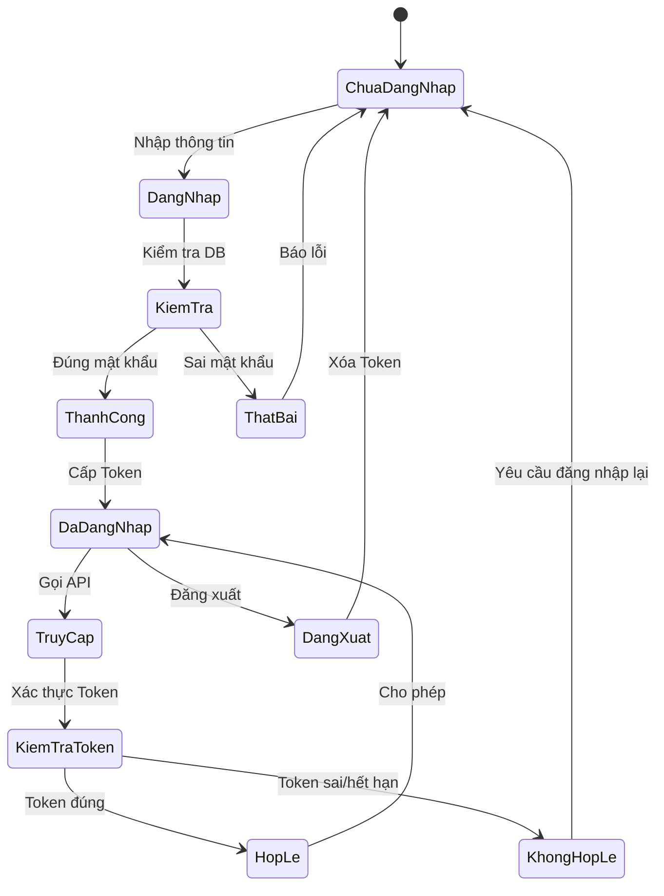

---

## 8. Kiến Trúc Triển Khai

### 8.1 Hạ Tầng Production

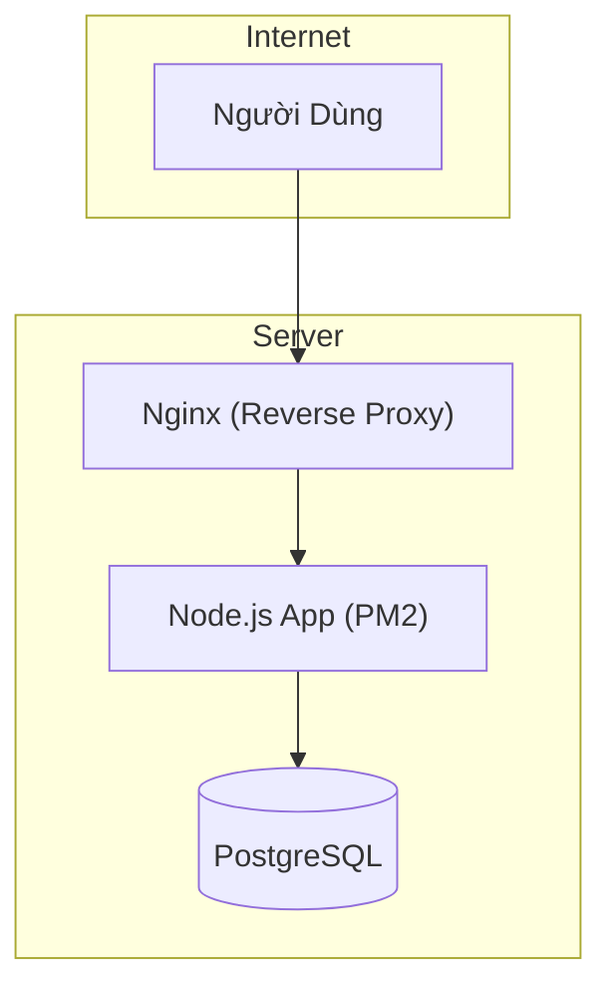

### 8.2 Môi Trường Dev vs Prod

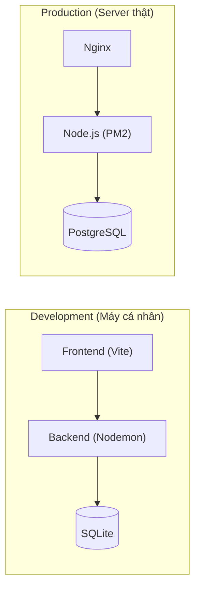
