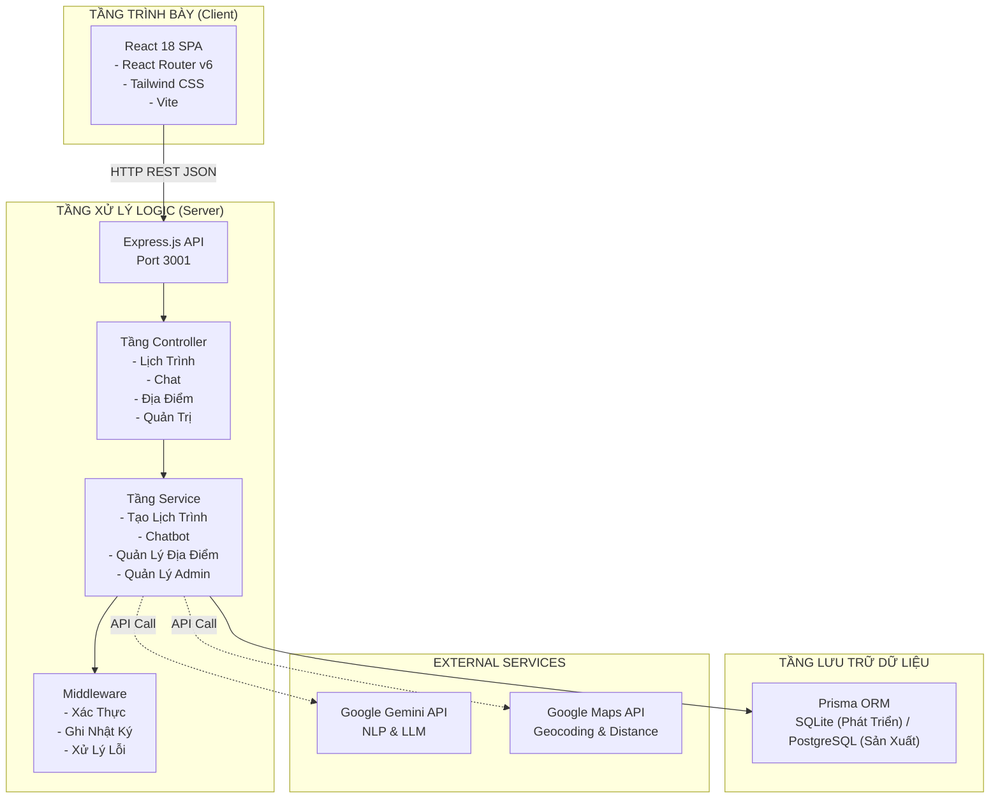
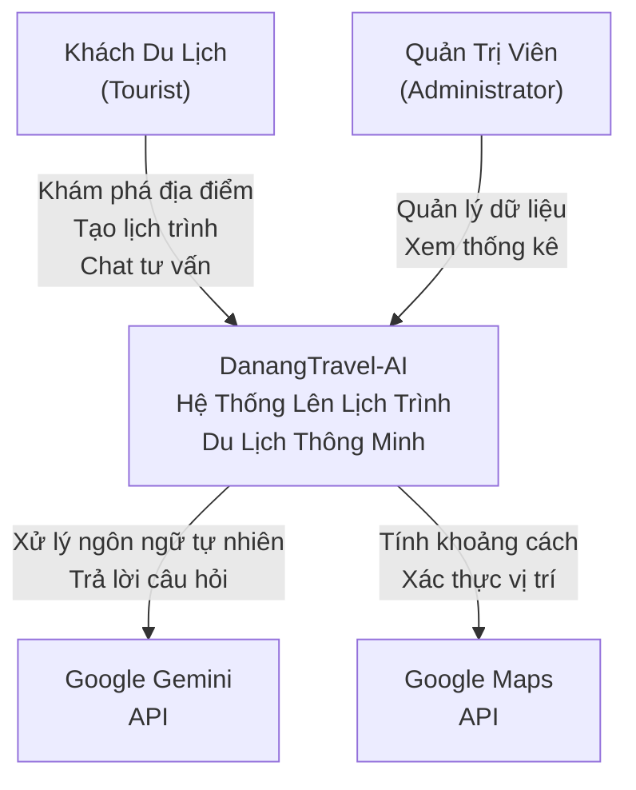
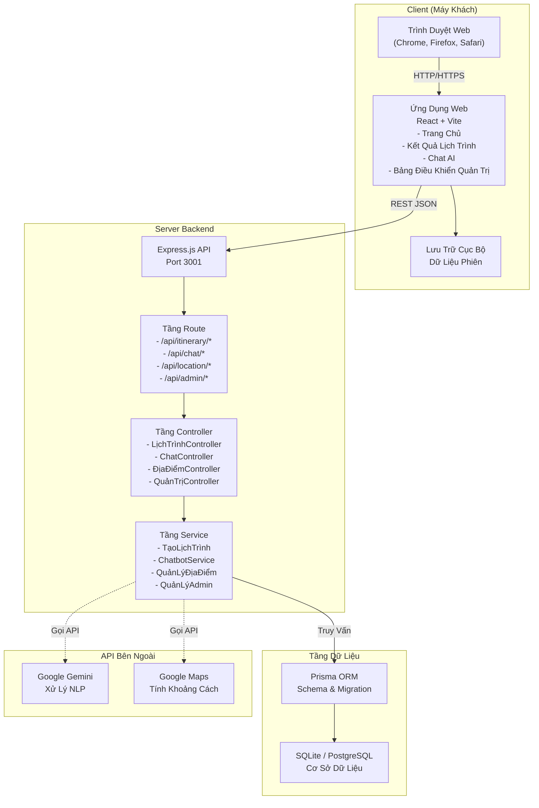
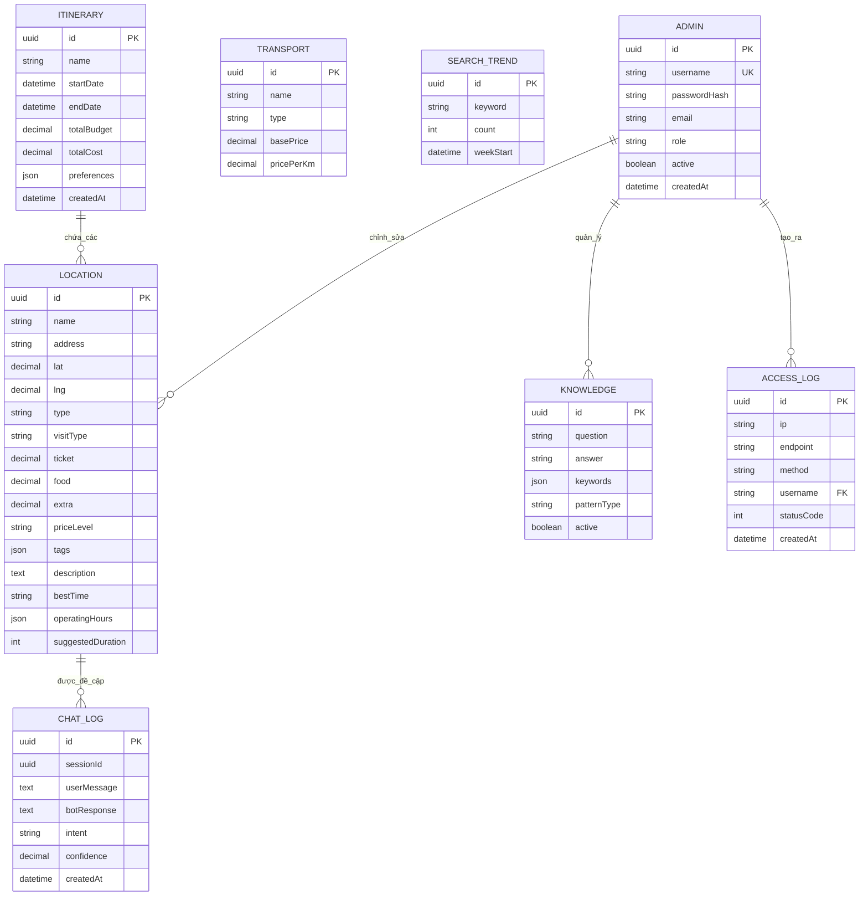
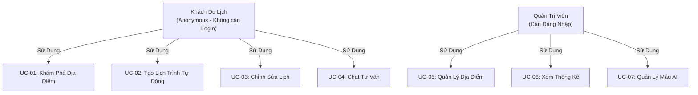
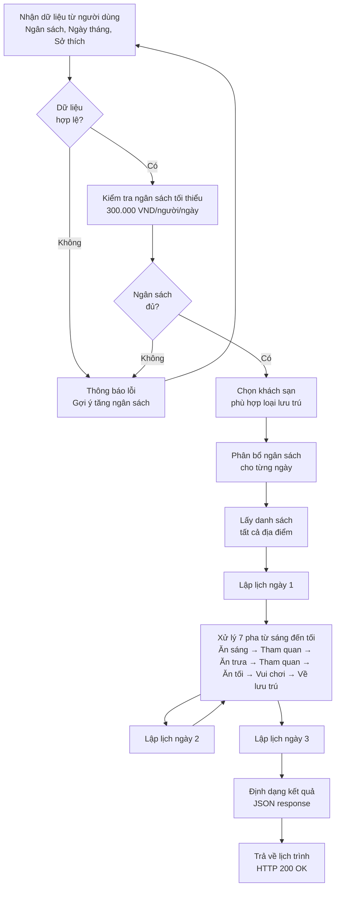
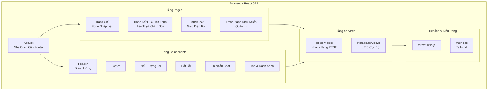
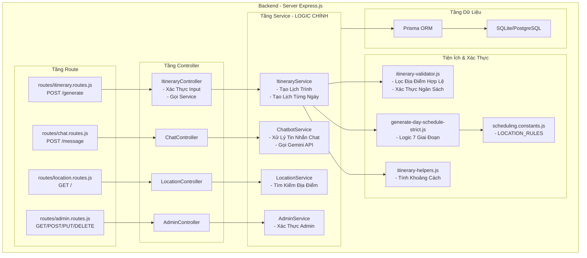
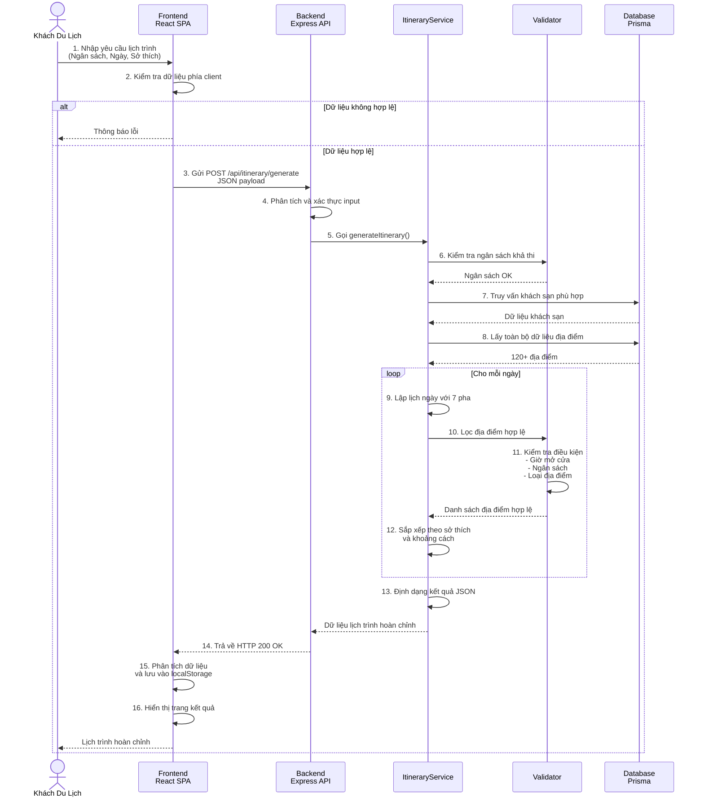
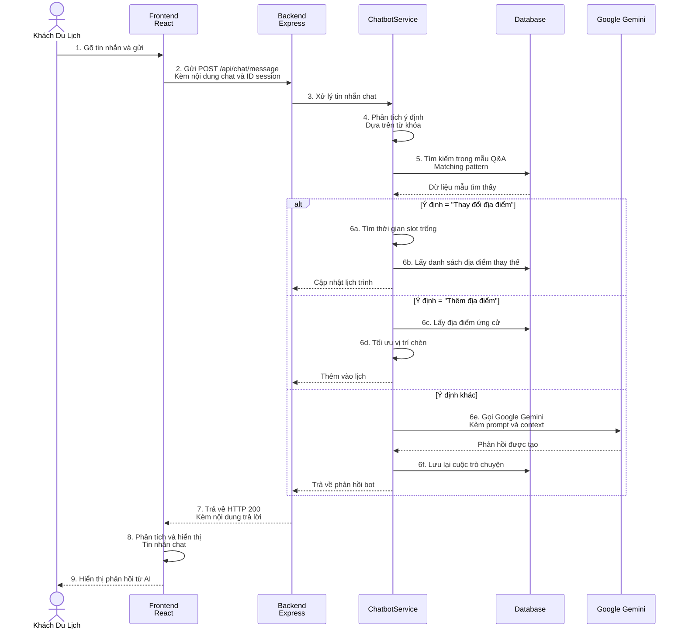

# TÀI LIỆU KIẾN TRÚC HỆ THỐNG

## DANANG TRAVEL-AI: Hệ Thống Lên Lịch Trình Du Lịch Thông Minh

**Ngôn ngữ tài liệu:** Tiếng Việt  
**Phiên bản:** 1.0  
**Ngày cập nhật:** 2025-12-06  
**Mục đích:** Cung cấp tài liệu kiến trúc chuẩn chỉnh theo tiêu chuẩn học thuật

---

## MỤC LỤC

1. [Tổng quan hệ thống](#1-tổng-quan-hệ-thống)
2. [Kiến trúc tổng thể](#2-kiến-trúc-tổng-thể)
3. [Thiết kế dữ liệu](#3-thiết-kế-dữ-liệu)
4. [Phân tích ca sử dụng](#4-phân-tích-ca-sử-dụng)
5. [Thiết kế chi tiết thành phần](#5-thiết-kế-chi-tiết-thành-phần)
6. [Luồng hoạt động chính](#6-luồng-hoạt-động-chính)
7. [Công nghệ và stack](#7-công-nghệ-và-stack)
8. [Cơ chế bảo mật](#8-cơ-chế-bảo-mật)

---

## 1. TỔNG QUAN HỆ THỐNG

### 1.1. Mô Tả Chung

**DanangTravel-AI** là một hệ thống quản lý lịch trình du lịch thông minh dành cho khách du lịch đến Đà Nẵng. Hệ thống cung cấp các tính năng chính:

- **Tạo lịch trình tự động:** Lập lịch dựa trên ngân sách, thời gian, sở thích, và ràng buộc (loại vận chuyển, chỗ ở)
- **Gợi ý địa điểm thông minh:** Sử dụng AI để phân tích dữ liệu người dùng và gợi ý địa điểm phù hợp
- **Quản lý 120+ địa điểm:** Cơ sở dữ liệu bao gồm 30 nhà ăn, 50+ điểm tham quan, 20+ lưu trú, 10+ khác
- **Chatbot tương tác:** Trợ lý AI giúp trả lời câu hỏi, chỉnh sửa lịch, và tối ưu hóa chi phí
- **Bảng điều khiển quản trị:** Công cụ quản lý dữ liệu, lịch sử truy cập, xu hướng tìm kiếm

### 1.2. Mục Tiêu Kiến Trúc

1. **Scalability:** Hỗ trợ 1,000+ người dùng đồng thời
2. **Maintainability:** Mã được tổ chức theo từng tầng rõ ràng
3. **Performance:** Thời gian phản hồi API < 2 giây
4. **Extensibility:** Dễ mở rộng tính năng mà không ảnh hưởng code hiện tại
5. **Security:** Bảo vệ dữ liệu người dùng, xác thực Admin, phân quyền

### 1.3. Giả Định Thiết Kế

- Người dùng chủ yếu truy cập từ thiết bị di động và máy tính
- Lưu lượng cao vào các giờ: buổi tối (19h-22h), cuối tuần
- Dữ liệu lịch sử được giữ lại tối thiểu 1 năm

---

## 2. KIẾN TRÚC TỔNG THỂ

### 2.1. Mô Hình Kiến Trúc: Three-Tier + External Services

Hệ thống được thiết kế theo mô hình ba tầng (Three-Tier Architecture) với tích hợp dịch vụ bên thứ ba:



### 2.2. Sơ Đồ C4 Level 1: System Context

Sơ đồ này mô tả các tác nhân bên ngoài và cách họ tương tác với hệ thống, cùng các dịch vụ ngoài mà hệ thống phụ thuộc vào.



### 2.3. Sơ Đồ C4 Level 2: Container Diagram



---

## 3. THIẾT KẾ DỮ LIỆU

### 3.1. Sơ Đồ Entity-Relationship (ERD)

Sơ đồ quan hệ thực thể mô tả cấu trúc cơ sở dữ liệu hoàn chỉnh với các mối quan hệ từng-một (1-1), từng-nhiều (1-N) và nhiều-nhiều (N-N) giữa các bảng.



Mối quan hệ chi tiết:

- **ADMIN - KNOWLEDGE** (1-N): Một quản trị viên quản lý nhiều mẫu Q&A cho chatbot
- **ADMIN - LOCATION** (1-N): Một quản trị viên có thể chỉnh sửa nhiều địa điểm
- **ADMIN - ACCESS_LOG** (1-N): Mỗi bản ghi lịch sử truy cập liên kết với một admin
- **LOCATION - CHAT_LOG** (1-N): Một địa điểm có thể được đề cập nhiều lần trong các cuộc trò chuyện
- **ITINERARY - LOCATION** (N-N): Một lịch trình chứa nhiều địa điểm, một địa điểm có thể xuất hiện trong nhiều lịch trình

### 3.2. Thông Số Dữ Liệu

| Bảng         | Số bản ghi | Ghi chú                                                          |
| ------------ | ---------- | ---------------------------------------------------------------- |
| LOCATION     | 120+       | Phân chia chi tiết: 30 nhà ăn, 50+ điểm tham quan, 20+ khách sạn |
| ADMIN        | 1-5        | Tài khoản quản trị                                               |
| KNOWLEDGE    | 50-100     | Mẫu Q&A cho chatbot                                              |
| TRANSPORT    | 6-8        | Các phương tiện di chuyển (taxi, grab, xe riêng...)              |
| ACCESS_LOG   | 1M+/năm    | Dữ liệu thống kê (≈100 requests/ngày × 365)                      |
| CHAT_LOG     | 100K+/năm  | Lịch sử tương tác người dùng                                     |
| SEARCH_TREND | 10K+/năm   | Xu hướng tìm kiếm theo tuần                                      |

### 3.3. Chuẩn Hóa Dữ Liệu

- **Mức chuẩn hóa:** 3NF (Third Normal Form)
- **Không dư thừa:** Mỗi dữ liệu lưu một lần duy nhất
- **Ràng buộc toàn vẹn:** Foreign Keys khai báo rõ ràng
- **Hiệu suất:** Indexed trên: `username`, `type`, `area`, `createdAt`

---

## 4. PHÂN TÍCH CA SỬ DỤNG

### 4.1. Các Tác Nhân (Actors)

| Tác Nhân          | Vai Trò            | Quyền Hạn                                     |
| ----------------- | ------------------ | --------------------------------------------- |
| **Khách Du Lịch** | Người dùng cuối    | Xem địa điểm, tạo lịch trình, chat với AI     |
| **Quản Trị Viên** | Quản lý hệ thống   | CRUD dữ liệu, xem thống kê, cấu hình hệ thống |
| **Google Gemini** | Dịch vụ bên thứ ba | Xử lý NLP, tạo phản hồi thông minh            |
| **Google Maps**   | Dịch vụ bên thứ ba | Tính khoảng cách, xác thực vị trí             |

### 4.1.1. Ghi Chú Quan Trọng: Chế Độ Xác Thực Hiện Tại

**Khách Du Lịch (User Thường):**

- **Hiện tại**: Không cần đăng nhập, truy cập **Anonymous** (Ẩn danh)
- **Cách hoạt động**:
  - Khách vào web → Xem địa điểm ngay lập tức
  - Tạo lịch trình không cần tài khoản
  - Lịch trình được lưu **tạm thời trong localStorage** của trình duyệt
  - Khi tắt trình duyệt → Dữ liệu mất (hoặc được ghi nhớ nếu bật LocalStorage)
- **Schema**: Không có bảng `User` trong database
- **Tracking**: AccessLog vẫn ghi nhận hành động nhưng `username = null` và `role = null`

**Quản Trị Viên (Admin):**

- **Cần đăng nhập**: Username + Password
- **Cách hoạt động**:
  - Truy cập `/api/admin/login`
  - Xác thực trong bảng `Admin` (schema.prisma)
  - Nhận session token (HttpOnly Cookie)
  - Có thể CRUD dữ liệu, xem thống kê
- **Middleware**: `adminAuth.middleware.js` bảo vệ routes `/api/admin/*`

**Ý Nghĩa Thiết Kế:**

- **Đơn giản hoá UX**: Khách không cần đăng ký, vào là sử dụng ngay
- **Phase 2 (Tương Lai)**: Có thể thêm User Authentication để lưu lịch trình cá nhân
- **Hiện tại tập trung vào**: Admin quản lý dữ liệu, khách dùng miễn phí

### 4.2. Danh Sách Ca Sử Dụng

Hệ thống cung cấp 7 ca sử dụng chính dành cho hai loại tác nhân: khách du lịch (ẩn danh) và quản trị viên (yêu cầu đăng nhập).



Bảng mô tả chi tiết:

| ID    | Tên Ca Sử Dụng         | Tác Nhân      | Loại      | Mô Tả                                                                                    |
| ----- | ---------------------- | ------------- | --------- | ---------------------------------------------------------------------------------------- |
| UC-01 | Khám phá địa điểm      | Khách du lịch | Chính     | Xem danh sách các địa điểm trong Đà Nẵng, tìm kiếm theo tên, lọc theo loại hoặc giá tiền |
| UC-02 | Tạo lịch trình tự động | Khách du lịch | **Chính** | Tạo lịch trình hoàn chỉnh từ yêu cầu về ngân sách, ngày tháng, sở thích                  |
| UC-03 | Chỉnh sửa lịch         | Khách du lịch | Phụ       | Thay thế hoặc xóa các hoạt động trong lịch trình đã tạo                                  |
| UC-04 | Chat với AI tư vấn     | Khách du lịch | Phụ       | Trò chuyện để tối ưu lịch, hỏi đáp về địa điểm, thay đổi lịch theo gợi ý                 |
| UC-05 | Quản lý địa điểm       | Quản trị viên | **Chính** | Thêm, sửa, xóa thông tin địa điểm, cập nhật giá vé và giờ hoạt động                      |
| UC-06 | Xem thống kê hệ thống  | Quản trị viên | Phụ       | Xem lịch sử truy cập, xu hướng tìm kiếm, số lượt dùng các tính năng                      |
| UC-07 | Quản lý mẫu trả lời AI | Quản trị viên | **Chính** | Thêm hoặc chỉnh sửa các mẫu câu hỏi-trả lời để huấn luyện chatbot                        |

### 4.3. Chi Tiết UC-02: Generate Itinerary

Đây là ca sử dụng chính của hệ thống, nơi khách du lịch cung cấp yêu cầu và nhận lại lịch trình hoàn chỉnh. Quy trình bao gồm xác thực dữ liệu, phân bổ ngân sách, chọn lưu trú, và lập lịch chi tiết cho từng ngày.

**Quy Trình Tạo Lịch Trình:**



---

## 5. THIẾT KẾ CHI TIẾT THÀNH PHẦN

### 5.1. Tầng Frontend (Presentation Layer)

**Tổ chức Thư Mục:**

```
Frontend/
├── src/
│   ├── components/       # Reusable UI
│   ├── pages/           # Page components
│   ├── features/        # Feature modules
│   ├── services/        # API client
│   ├── utils/           # Helper functions
│   └── styles/          # Tailwind CSS
├── public/              # Static assets
├── vite.config.js
└── tailwind.config.js
```

**Sơ đồ Component Structure:**



**Stack Công Nghệ:**

- React 18.x + React Hooks
- Vite 5.x (Build tool)
- React Router v6 (Navigation)
- Tailwind CSS (Styling)
- Fetch API (HTTP client)

**Các Trang Chính:**

- HomePage: Biểu mẫu nhập liệu
- ItineraryResultsPage: Hiển thị lịch trình chi tiết
- ChatPage: Giao diện chatbot tương tác
- AdminDashboardPage: Bảng điều khiển quản trị

### 5.2. Tầng Backend (Business Logic Layer)

**Tổ chức Thư Mục:**

```
Backend/
├── src/
│   ├── routes/          # API endpoints
│   ├── controllers/     # Request handlers
│   ├── services/        # Business logic
│   ├── middleware/      # Middleware functions
│   ├── utils/           # Helper functions
│   ├── adapters/        # External APIs
│   └── config/          # Constants
├── prisma/
│   ├── schema.prisma    # DB schema
│   ├── seed.js          # Seed script
│   └── migrations/      # DB migrations
└── scripts/             # Utility scripts
```

**Sơ đồ Service Architecture:**



**Stack Công Nghệ:**

- Node.js 18+
- Express.js 4.x
- Prisma 5.x (ORM)
- SQLite (phát triển) / PostgreSQL (sản xuất)
- Google Gemini API
- Google Maps API
- npm 10.x

```javascript
ItineraryService.generateItinerary()
  ├─ validateBudgetFeasibility()
  ├─ selectAccommodation()
  ├─ allocateBudgetPerDay()
  ├─ generateDayScheduleStrict() [7 phases]
  └─ formatOutput()

ChatbotService.processChatMessage()
  ├─ extractIntent()
  ├─ queryKnowledgeBase()
  ├─ callGeminiAPI()
  ├─ executeAction()
  └─ logChatMessage()

LocationService
  ├─ getAllLocations()
  ├─ searchLocations()
  └─ updateLocation()

AdminService
  ├─ authenticate()
  ├─ manageChatLogs()
  └─ manageLocations()
```

---

## 6. LUỒNG HOẠT ĐỘNG CHÍNH

### 6.1. Luồng: Tạo Lịch Trình (Complete Flow)

Quy trình hoàn chỉnh từ khi khách du lịch nhập yêu cầu cho đến khi nhận lạichương trình:



### 6.2. Luồng: Chatbot Interaction

Quy trình khi khách du lịch chat với trợ lý AI để tư vấn hoặc chỉnh sửa lịch:



---

## 7. CÔNG NGHỆ VÀ STACK

### 7.1. Frontend Stack

| Thành phần      | Công nghệ    | Phiên bản |
| --------------- | ------------ | --------- |
| Framework       | React        | 18.x      |
| Build Tool      | Vite         | 5.x       |
| Routing         | React Router | 6.x       |
| Styling         | Tailwind CSS | 3.x       |
| HTTP            | Fetch API    | Native    |
| State           | React Hooks  | Native    |
| Package Manager | npm          | 10.x      |

### 7.2. Backend Stack

| Thành phần      | Công nghệ     | Phiên bản |
| --------------- | ------------- | --------- |
| Runtime         | Node.js       | 18+LTS    |
| Framework       | Express.js    | 4.x       |
| ORM             | Prisma        | 5.x       |
| DB (Dev)        | SQLite        | 3.x       |
| DB (Prod)       | PostgreSQL    | 14+       |
| External AI     | Google Gemini | v1        |
| External API    | Google Maps   | v3        |
| Package Manager | npm           | 10.x      |

### 7.3. DevOps & Deployment

| Thành phần      | Công Nghệ              | Ghi Chú               |
| --------------- | ---------------------- | --------------------- |
| Version Control | Git + GitHub           | Repository management |
| Environment     | .env files             | Configuration         |
| DB Migration    | Prisma Migrate         | Schema versioning     |
| Logging         | Console + DB           | Audit trail           |
| Error Handling  | Try-Catch + Middleware | Exception management  |

---

## 8. CƠ CHẾ BẢO MẬT

### 8.1. Xác Thực (Authentication)

**Mục tiêu:** Chỉ admin được phép truy cập chức năng quản trị

**Cơ chế:**

- Admin đăng nhập: username + password
- Password mã hóa bcrypt (one-way function)
- Cấp session token / JWT sau xác thực
- Token gửi trong header `Authorization: Bearer <token>`
- Mọi request quản trị phải có token hợp lệ

**Implementation:**

```javascript
POST /api/admin/login
{username, password}

Backend:
→ Query database: SELECT * WHERE username = ?
→ Compare: bcrypt.compare(input, hash)
→ If match: jwt.sign({adminId}, SECRET_KEY, {expiresIn: '7d'})
→ Return: {token}
```

### 8.2. Phân Quyền (Authorization)

**Roles:**

- **admin:** Toàn quyền
- **guest:** Chỉ tạo lịch, chat (không quản trị)

**Middleware kiểm tra:**

```javascript
function authAdminMiddleware(req, res, next) {
  const token = req.headers.authorization?.split(" ")[1];
  if (!token) return res.status(401).json({ error: "No token" });

  try {
    const decoded = jwt.verify(token, SECRET_KEY);
    req.adminId = decoded.adminId;
    next();
  } catch {
    res.status(401).json({ error: "Invalid token" });
  }
}
```

### 8.3. Bảo Vệ Dữ Liệu

**SQL Injection:** Sử dụng Prisma ORM (parameterized queries)

**CORS:** Chỉ accept requests từ trusted origin

```javascript
app.use(
  cors({
    origin: process.env.FRONTEND_URL,
    credentials: true,
  })
);
```

**Input Validation:** Validate tất cả input trước xử lý

```javascript
const errors = validateUserRequest(req.body);
if (errors.length > 0) {
  return res.status(400).json({ errors });
}
```

**HTTPS in Production:** Tất cả traffic sử dụng SSL/TLS

### 8.4. Logging & Audit Trail

```javascript
// Access Log
INSERT INTO AccessLog (ip, endpoint, method, statusCode...)

// Chat Log
INSERT INTO ChatLog (userMessage, botResponse, intent...)

// Admin Actions
INSERT INTO AdminActionLog (adminId, action, affectedRecords...)
```

---

## 9. PHÂN TÍCH HIỆU NĂNG

### 9.1. Độ Phức Tạp (Complexity Analysis)

| Operation             | Time Complexity | Ghi Chú                  |
| --------------------- | --------------- | ------------------------ |
| Fetch all locations   | O(n)            | n = 120                  |
| Generate itinerary    | O(n × d × p)    | d=days, p=phases         |
| Search location       | O(n log n)      | Binary search            |
| Optimize sequence     | O(n log n)      | Clustering               |
| Generate day schedule | O(m × k)        | m=7 phases, k=candidates |

**Ước tính:** Tạo lịch 3 ngày ≈ 50-150ms

### 9.2. Tối Ưu Hóa

**Caching:**

- Cache danh sách locations (Memory)
- Cache Knowledge Base patterns
- Invalidate on update

**Database Indexing:**

```sql
CREATE INDEX idx_location_type ON Location(type);
CREATE INDEX idx_location_area ON Location(area);
CREATE INDEX idx_admin_username ON Admin(username);
CREATE INDEX idx_log_created ON AccessLog(createdAt);
```

---

## KẾT LUẬN

Kiến trúc **DanangTravel-AI** được thiết kế theo các nguyên tắc SOLID:

- **Separation of Concerns:** Tầng rõ ràng (Presentation, Business, Data)
- **Single Responsibility:** Mỗi service làm một việc
- **DRY:** Loại bỏ trùng lặp code
- **Scalable:** Hỗ trợ tối thiểu 1000+ người dùng đồng thời
- **Secure:** Bảo vệ dữ liệu, xác thực Admin, phân quyền
- **Maintainable:** Dễ hiểu, dễ mở rộng

Hệ thống này phù hợp cho mục đích học thuật, thực tiễn, và có tiềm năng phát triển sang Microservices trong tương lai.

---

**Tài liệu được chuẩn bị theo tiêu chuẩn học thuật cho mục đích đánh giá chất lượng dự án**
