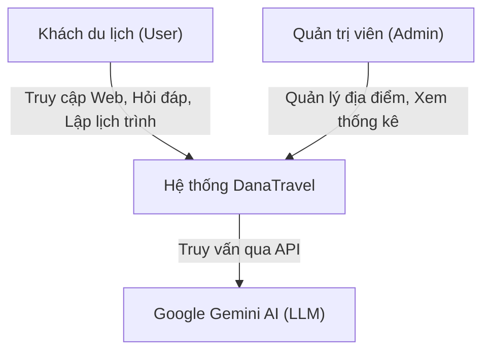
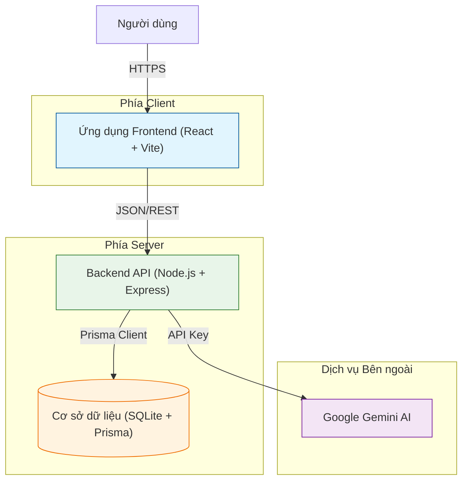
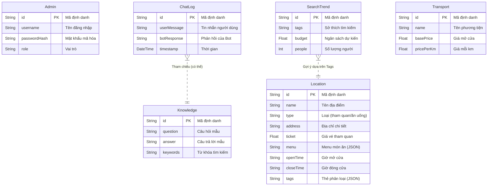
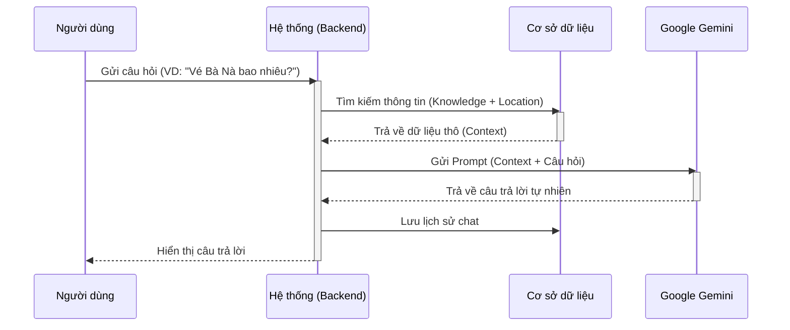

# Tài liệu Kiến trúc Hệ thống DanaTravel

> [!NOTE]
> Tài liệu này cung cấp cái nhìn tổng quan về kỹ thuật, kiến trúc, thiết kế dữ liệu và các luồng hoạt động chính của hệ thống DanaTravel.

## 1. Tổng quan Hệ thống

DanaTravel là một nền tảng **Trợ lý Du lịch Thông minh** sử dụng AI và các thuật toán ràng buộc chặt chẽ để lập kế hoạch du lịch cá nhân hóa.

### 1.1. Bối cảnh Hệ thống (C4 Level 1)



### 1.2. Kiến trúc Container (C4 Level 2)

Hệ thống được xây dựng theo kiến trúc Monolithic với Frontend và Backend tách biệt, giao tiếp qua RESTful APIs.



## 2. Sơ đồ Use Case (Chi tiết)

Sơ đồ Use Case mô tả các tương tác giữa các tác nhân (Actors) và hệ thống.

### 2.1. Các Tác nhân (Actors)

1.  **Khách du lịch (Traveler/User)**: Người dùng cuối truy cập hệ thống để tìm kiếm thông tin và lập kế hoạch du lịch.
2.  **Quản trị viên (Admin)**: Người quản lý nội dung, dữ liệu địa điểm và theo dõi hoạt động của hệ thống.
3.  **Hệ thống AI (Gemini)**: Tác nhân phụ hỗ trợ trả lời câu hỏi và gợi ý lịch trình thông minh.

### 2.2. Danh sách Use Case

**Nhóm Khách du lịch:**
*   **Lập lịch trình tự động**: Nhập ngân sách, số ngày, sở thích để tạo lịch trình.
*   **Tùy chỉnh lịch trình**: Thay đổi các tham số để tạo lại lịch trình.
*   **Trò chuyện với AI**: Hỏi đáp thông tin du lịch Đà Nẵng.
*   **Tra cứu địa điểm**: Xem thông tin chi tiết, giá vé, menu của các địa điểm.

**Nhóm Quản trị viên:**
*   **Đăng nhập hệ thống**: Truy cập vào trang quản trị.
*   **Quản lý địa điểm**: Thêm, sửa, xóa thông tin địa điểm du lịch/ăn uống.
*   **Quản lý tri thức AI**: Cập nhật cơ sở dữ liệu câu hỏi/câu trả lời cho Chatbot.
*   **Xem báo cáo thống kê**: Xem lưu lượng truy cập, xu hướng tìm kiếm.
*   **Quản lý tài khoản**: Thêm hoặc xóa các quản trị viên khác.

### 2.3. Sơ đồ Minh họa (Mermaid)

```mermaid
usecaseDiagram
    actor "Khách du lịch" as User
    actor "Quản trị viên" as Admin
    actor "Hệ thống AI (Gemini)" as AI

    package "Hệ thống DanaTravel" {
        usecase "Lập lịch trình du lịch" as UC1
        usecase "Trò chuyện tư vấn (Chatbot)" as UC2
        usecase "Tra cứu thông tin địa điểm" as UC3
        usecase "Đăng nhập quản trị" as UC4
        usecase "Quản lý địa điểm" as UC5
        usecase "Quản lý tri thức Chatbot" as UC6
        usecase "Xem báo cáo thống kê" as UC7
        usecase "Quản lý tài khoản Admin" as UC8
    }

    User --> UC1
    User --> UC2
    User --> UC3

    Admin --> UC4
    UC4 ..> UC5 : include
    UC4 ..> UC6 : include
    UC4 ..> UC7 : include
    UC4 ..> UC8 : include

    UC2 ..> AI : sử dụng
    UC1 ..> AI : hỗ trợ (tùy chọn)
```

## 3. Thiết kế Cơ sở dữ liệu (ERD)

Sơ đồ mô tả cấu trúc dữ liệu và mối quan hệ giữa các thực thể trong hệ thống.

### 3.1. Các Thực thể (Entities)

1.  **Location (Địa điểm)**: Lưu trữ thông tin các điểm tham quan, nhà hàng, khách sạn.
2.  **Admin (Quản trị viên)**: Tài khoản quản trị hệ thống.
3.  **Knowledge (Tri thức)**: Dữ liệu hỏi đáp mẫu dùng cho RAG (Retrieval-Augmented Generation).
4.  **ChatLog (Lịch sử Chat)**: Lưu lại các cuộc hội thoại giữa người dùng và Bot.
5.  **AccessLog (Nhật ký truy cập)**: Ghi lại hoạt động truy cập API để thống kê.
6.  **SearchTrend (Xu hướng tìm kiếm)**: Lưu lại các từ khóa và nhu cầu tìm kiếm của người dùng.
7.  **Transport (Phương tiện)**: Bảng giá và loại hình phương tiện di chuyển.

### 3.2. Sơ đồ Minh họa (Mermaid)



## 4. Luồng Hoạt động Chi tiết (Activity Flows)

### 4.1. Quy trình Lập Lịch trình Du lịch (Itinerary Generation)

Đây là quy trình phức tạp nhất, sử dụng thuật toán CSP (Constraint Satisfaction Problem) để đảm bảo lịch trình khả thi.

**Mô tả luồng:**
1.  Người dùng nhập: Ngân sách, Số ngày, Sở thích (Tags).
2.  Hệ thống lọc danh sách `Location` phù hợp với Sở thích.
3.  Hệ thống khởi tạo lịch trình rỗng cho từng ngày.
4.  **Vòng lặp xếp lịch (Greedy + Backtracking)**:
    *   Chọn địa điểm ăn trưa/tối phù hợp ngân sách.
    *   Chọn địa điểm tham quan dựa trên khoảng cách địa lý (gần địa điểm trước đó) và giờ mở cửa.
    *   Kiểm tra ràng buộc: Tổng chi phí < Ngân sách, Tổng thời gian < Thời gian trong ngày.
5.  Nếu không tìm được phương án khả thi -> Thông báo hoặc gợi ý nới lỏng ngân sách.
6.  Nếu thành công -> Trả về JSON lịch trình chi tiết.

```mermaid
flowchart TD
    Start([Bắt đầu]) --> Input[/Nhập: Ngân sách, Số ngày, Sở thích/]
    Input --> Filter[Lọc Địa điểm theo Sở thích]
    Filter --> Init[Khởi tạo Lịch trình rỗng]
    
    subgraph Scheduling_Algorithm [Thuật toán Xếp lịch]
        LoopDay{Còn ngày trống?}
        Init --> LoopDay
        LoopDay -- Có --> SelectFood[Chọn quán ăn (Trưa/Tối)]
        SelectFood --> SelectAttr[Chọn điểm tham quan gần nhất]
        SelectAttr --> CheckConstraint{Kiểm tra Ràng buộc\n(Tiền & Thời gian)}
        
        CheckConstraint -- Thỏa mãn --> AddToPlan[Thêm vào Lịch trình]
        CheckConstraint -- Vi phạm --> Backtrack[Quay lui / Chọn điểm khác]
        
        AddToPlan --> LoopDay
    end
    
    LoopDay -- Hết --> Result[/Trả về Lịch trình/]
    Result --> End([Kết thúc])
```

### 4.2. Quy trình Chatbot RAG (Retrieval-Augmented Generation)

Quy trình xử lý khi người dùng đặt câu hỏi cho Chatbot.

**Mô tả luồng:**
1.  Người dùng gửi tin nhắn.
2.  Hệ thống tìm kiếm từ khóa trong bảng `Knowledge` và `Location`.
3.  Lấy các thông tin liên quan nhất (Context).
4.  Gửi Prompt = "Context + Câu hỏi người dùng" đến Google Gemini AI.
5.  Gemini trả về câu trả lời tự nhiên.
6.  Hệ thống lưu hội thoại vào `ChatLog` và hiển thị cho người dùng.



## 5. Cấu trúc Thư mục Dự án

```
Dana-Travel/
├── Frontend/           # Ứng dụng React
│   ├── src/
│   │   ├── components/ # Các thành phần UI tái sử dụng
│   │   ├── features/   # Các module tính năng (itinerary, admin...)
│   │   ├── pages/      # Các trang điều hướng (Route pages)
│   │   └── services/   # Các service gọi API
│
├── Backend/            # Ứng dụng Express
│   ├── prisma/         # Schema cơ sở dữ liệu & seeds
│   ├── src/
│   │   ├── config/     # Cấu hình & Hằng số (Rules, prompts)
│   │   ├── controllers/# Bộ xử lý yêu cầu (Request handlers)
│   │   ├── services/   # Logic nghiệp vụ (The "Brain")
│   │   ├── routes/     # Các điểm cuối API (Endpoints)
│   │   └── utils/      # Tiện ích hỗ trợ (Tính khoảng cách, định dạng)
│
└── docs/               # Tài liệu dự án
```
