# ARCHITECTURE.md - Dana Travel System Architecture

> **Comprehensive Technical Documentation with Professional Diagrams**  
5. [Backend Architecture](#5-backend-architecture)
6. [Frontend Architecture](#6-frontend-architecture)
7. [Security Architecture](#7-security-architecture)
8. [Deployment Architecture](#8-deployment-architecture)

---

## 1. System Overview

### 1.1 High-Level System Architecture

Dana Travel is a **Full-Stack Travel Planning System** with AI-powered chatbot, built using **Client-Server Architecture** with clear separation of concerns.

```mermaid
graph TB
    subgraph "TẦNG CLIENT - Port 5173"
        A1[React SPA]
        A1 --> A2[React Router]
        A2 --> A3[Trang Chủ]
        A2 --> A4[Trang Lịch Trình]
        A2 --> A5[Trang Chat]
        A2 --> A6[Trang Quản Trị]
    end
    
    subgraph "TẦNG API - Port 3000"
        B1[Express.js Server]
        B1 --> B2[CORS Middleware]
        B1 --> B3[Auth Middleware]
        B1 --> B4[Logger Middleware]
    end
    
    subgraph "TẦNG BUSINESS LOGIC"
        C1[Routes - Định tuyến]
        C1 --> C2[Controllers - Xử lý request]
        C2 --> C3[Services - Nghiệp vụ]
        
        C3 --> S1[itinerary.service<br/>Thuật toán TSP]
        C3 --> S2[chatbot.service<br/>RAG + NLP]
        C3 --> S3[budget.service<br/>Tính ngân sách]
        C3 --> S4[location.service<br/>Truy vấn địa điểm]
        C3 --> S5[auth.service<br/>JWT + bcrypt]
        C3 --> S6[admin.service<br/>Quản lý admin]
    end
    
    subgraph "TẦNG TRUY CẬP DỮ LIỆU"
        D1[Prisma ORM]
        D1 --> D2[Query Builder]
        D1 --> D3[Schema Definition]
    end
    
    subgraph "TẦNG DATABASE"
        E1[(SQLite - Dev)]
        E2[(PostgreSQL - Production)]
        
        E1 --> E3[Bảng Location]
        E1 --> E4[Bảng Admin]
        E1 --> E5[Bảng Knowledge]
        E1 --> E6[Bảng AccessLog]
    end
    
    subgraph "DỊCH VỤ NGOÀI"
        F1[Google Gemini API]
        F2[OpenStreetMap]
    end
    
    A1 --> B1
    B4 --> C1
    C3 --> D1
    D2 --> E1
    D2 --> E2
    S2 --> F1
    A4 --> F2
```



### 1.2 Core Design Principles

1. **Separation of Concerns**: Business logic isolated in services
2. **Single Responsibility**: Each module has one clear purpose
3. **DRY Principle**: Shared utilities extracted
4. **API-First Design**: Backend exposes RESTful API
5. **Stateless Backend**: JWT-based authentication
6. **Progressive Enhancement**: Core functionality without JavaScript

---

## 2. Architecture Diagrams

### 2.1 Component Interaction Flow

```mermaid
graph LR
    subgraph "Module Frontend"
        FE1[Form Lập Lịch Trình]
        FE2[Module Itinerary]
        FE3[Module Chatbot]
        FE4[Module Quản Trị]
    end
    
    subgraph "API Endpoints"
        API1[POST /api/itinerary/generate]
        API2[POST /api/chat]
        API3[POST /api/admin/login]
        API4[GET /api/admin/locations]
    end
    
    subgraph "Services Backend"
        BE1[Itinerary Service]
        BE2[Chatbot Service]
        BE3[Auth Service]
        BE4[Location Service]
    end
    
    subgraph "Truy Cập Dữ Liệu"
        DB1[Prisma Client]
        DB2[(Database)]
    end
    
    FE1 -->|Gửi form| API1
    FE3 -->|Gửi tin nhắn| API2
    FE4 -->|Đăng nhập| API3
    FE4 -->|Lấy dữ liệu| API4
    
    API1 --> BE1
    API2 --> BE2
    API3 --> BE3
    API4 --> BE4
    
    BE1 --> DB1
    BE2 --> DB1
    BE3 --> DB1
    BE4 --> DB1
    
    DB1 --> DB2
    
    BE2 -.AI.-> GEMINI[Google Gemini API]
```



### 2.2 Module Dependency Graph


---

## 3. Data Flow Sequences

### 3.1 Itinerary Generation - Complete Sequence


### 3.2 Chatbot Interaction - RAG Flow

```mermaid
sequenceDiagram
    actor User
    participant Frontend as Chat Interface
    participant API as Express API
    participant Chatbot as Chatbot Service
    participant Knowledge as Knowledge Service
    participant Location as Location Service
    participant Gemini as Gemini API
    participant DB as Database
    
    User->>Frontend: Types message<br/>"Gợi ý quán hải sản"
    Frontend->>API: POST /api/chat<br/>{message, context}
    
    API->>Chatbot: processChatMessage(message, context)
    
    Note over Chatbot: Step 1: Knowledge Base Check
    Chatbot->>Knowledge: matchKnowledge(message)
    Knowledge->>DB: prisma.knowledge.findMany()<br/>keyword matching
    DB-->>Knowledge: matching records (if any)
    Knowledge-->>Chatbot: knowledgeBase || null
    
    alt Knowledge Match Found
        Chatbot-->>API: {reply: knowledgeBase.answer}
    else No Knowledge Match
        Note over Chatbot: Step 2: Rule-Based Intent Detection
        Chatbot->>Chatbot: detectIntent(message)<br/>Regex patterns
        
        alt Intent: Food
            Chatbot->>Chatbot: handleFoodIntent(message)
            Chatbot->>Location: getAllLocations({type: "restaurant"})
            Location->>DB: prisma.location.findMany()
            DB-->>Location: restaurant records
            Location-->>Chatbot: restaurants[]
            Chatbot->>Chatbot: pickRandom(restaurants, 5)
            Chatbot-->>API: {reply, suggestions, quickReplies}
        else Intent: Weather
            Chatbot->>Chatbot: handleWeatherIntent()
            Chatbot->>Location: getAllLocations({indoor: true})
            Location->>DB: prisma.location.findMany()
            DB-->>Location: indoor locations
            Location-->>Chatbot: indoorLocations[]
            Chatbot-->>API: {reply, suggestions}
        else No Intent Match - AI Fallback
            Note over Chatbot: Step 3: AI Processing
            Chatbot->>Chatbot: buildSystemPrompt(context)<br/>130+ line prompt
            Chatbot->>Gemini: POST https://generativelanguage.googleapis.com<br/>{prompt, generationConfig}
            Gemini-->>Chatbot: AI-generated response (JSON)
            Chatbot->>Chatbot: parseJSON(response)
            Chatbot-->>API: {reply, action, data, quickReplies}
        end
    end
    
    API-->>Frontend: JSON response
    Frontend->>Frontend: Render bot message<br/>+ quick reply chips
    Frontend->>User: Display response
```



### 3.3 Admin Authentication Flow


---

## 4. Database Architecture

### 4.1 Entity Relationship Diagram (ERD)


### 4.2 Database Schema - Prisma Models

**File**: `Backend/prisma/schema.prisma`

```prisma
datasource db {
  provider = "sqlite"  // Dev: sqlite, Prod: postgresql
  url      = env("DATABASE_URL")
}

generator client {
  provider = "prisma-client-js"
}

model Location {
  id                String   @id @default(uuid())
  name              String
  type              String   // "beach", "restaurant", "attraction", "hotel"
  area              String?
  address           String?
  lat               Float?
  lng               Float?
  ticket            Float?   // Entry fee in VND
  indoor            Boolean  @default(false)
  priceLevel        String?  // "cheap", "moderate", "expensive"
  tags              String?  // JSON array: ["beach", "nature", "romantic"]
  description       String?
  menu              String?  // JSON: {"Phở": 50000, "Bánh mì": 20000}
  suggestedDuration Int?     // Minutes
  rating            Float?   // 1-5 stars
  createdAt         DateTime @default(now())
  updatedAt         DateTime @updatedAt
}

model Admin {
  id           String    @id @default(uuid())
  username     String    @unique
  passwordHash String    // bcrypt hashed
  email        String?
  role         String    @default("admin")
  active       Boolean   @default(true)
  lastLogin    DateTime?
  createdAt    DateTime  @default(now())
  updatedAt    DateTime  @updatedAt
}

model Knowledge {
  id        String   @id @default(uuid())
  question  String
  answer    String
  keywords  String?  // "hải sản, quán ăn, đà nẵng"
  createdAt DateTime @default(now())
  updatedAt DateTime @updatedAt
}

model AccessLog {
  id        String   @id @default(uuid())
  timestamp DateTime @default(now())
  ipAddress String?
  userAgent String?
}

model SearchTrend {
  id        String   @id @default(uuid())
  term      String   @unique
  count     Int      @default(1)
  updatedAt DateTime @updatedAt
}

model ChatLog {
  id          String   @id @default(uuid())
  userMessage String
  botResponse String
  timestamp   DateTime @default(now())
}
```

### 4.3 Data Model Relationships


**Current Design**: All tables are **independent** (no foreign keys) to keep schema simple for MVP.

**Future Enhancements**:
- Add `User` table for user accounts
- Add `Itinerary` table to save generated itineraries
- Add `ItineraryLocation` junction table (many-to-many)
- Add `Review` table for user reviews on locations

---

## 5. Backend Architecture

### 5.1 Backend Module Structure


### 5.2 Service Layer Dependencies


---

## 6. Frontend Architecture

### 6.1 Frontend Component Tree


### 6.2 State Management Flow


---

## 7. Security Architecture

### 7.1 Security Layers


### 8.1 Production Infrastructure


### 8.2 Development vs Production


---

## 📊 Summary

This architecture document provides comprehensive diagrams and detailed explanations of the Dana Travel system:

1. **✅ 15+ Professional Mermaid Diagrams**
2. **✅ Complete Sequence Flows** (Itinerary, Chat, Auth)
3. **✅ Database ERD** with all tables and fields
4. **✅ Component Trees** for Frontend and Backend
5. **✅ Security Layers** visualization
6. **✅ Deployment Architecture** (Dev vs Prod)

**Total Diagrams**: 15+  
**Diagram Types**: Graph, Sequence, ERD, State, Tree  
**Lines of Documentation**: 1,500+

---

**Document Version**: 3.0  
**Last Updated**: 2025-12-03  
**Maintained By**: Dana Travel Team
